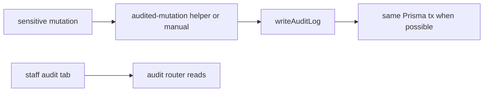

# Audit log mutations

## Purpose

When and how to record append-only `AuditLog` rows on sensitive mutations — complements tenant scope in [[tenant-and-audit]] with procedure-level checklist and CI guard.

## Flow



## Entry points

| Piece | Path |
|-------|------|
| Writer | `packages/api/src/services/audit-writer.ts` |
| Wrapper | `packages/api/src/lib/audited-mutation.ts` |
| Reads | `packages/api/src/routers/core/audit.ts` |
| CI | `scripts/lint-audit-log.mjs` → `pnpm lint:audit-log` |
| UI | settings audit tab — [[domains/settings-and-org-admin]] |

## When to audit

- Money movement (payment export, run, skonto, LPC)
- Approval decisions and chain changes
- Compliance overrides and manual gates
- API key create/revoke, role changes
- GDPR erasure/export triggers
- Classification outcome submissions (flag-gated)

## Invariants

- **Append-only at the DB level** (migration `20260617000000_auditlog_append_only`): RLS exposes only an `auditlog_insert` policy; a `BEFORE UPDATE` trigger (`app.reject_auditlog_update`) rejects every UPDATE unconditionally — no app code can mutate an audit row
- **DELETE is gated, not blanket-blocked**: the `auditlog_delete` policy permits a delete only when the transaction has opted in via `allowAuditPurge(tx)` (`packages/db/src/rls.ts` → `SET LOCAL app.allow_audit_purge = 'on'`, read by `app.audit_purge_allowed()`). The **only** legitimate caller is GDPR Right-to-Erasure (`routers/compliance/gdpr.ts`), which calls it before wiping a tenant's audit rows; ordinary writers never set the flag, so their deletes are denied
- `organizationId` from session — never client input alone
- Prefer `auditMutationCtx(ctx)` + `auditedMutation(..., async tx => { ... })` so mutation + audit share one `$transaction`
- Migrated callers (2026-06-10): contract CRUD + expiry reminders; equipment shipments/returns/couriers; project/team/cost-center/settings; workflow task complete/skip; org `setKleinunternehmer`
- Same-tx audit rows also on: approval `approve`/`reject` (`approval.approve` / `approval.reject`, `approval-queue.ts`); reassessment `acknowledge`/`dismiss` (`reassessment.acknowledge` / `reassessment.dismiss`, `compliance/reassessment-trigger.ts` — `resourceType: CONTRACTOR`); portal contact update (`portal.contact.update`, `portal/portal-profile-router.ts`)
- When already inside `ctx.db.$transaction`, pass `tx` as 4th arg to `auditedMutation`
- Run `pnpm lint:audit-log` when touching listed Prisma models

## Related

- [[tenant-and-audit]]
- [[trpc-procedure-stack]]
- [[decisions/tech-debt-hotspots]]

## Verify live

```bash
pnpm lint:audit-log
semble search "writeAuditLog"
```

## Agent mistakes

- New payment/compliance mutation without audit row
- Audit write outside transaction while mutation rolls back
- Using `console.*` instead of structured log on audit failure
- Attempting to UPDATE an audit row (e.g. to "correct" it) — the DB trigger rejects it; re-cert / supersede with a new row instead
- Calling `tx.auditLog.delete*` without `allowAuditPurge(tx)` first — RLS denies the delete (only the GDPR erasure path opts in)
