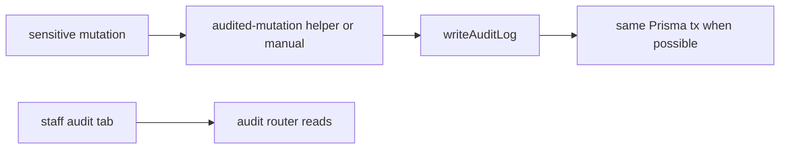

# Audit log mutations

## Purpose

When and how to record append-only `AuditLog` rows on sensitive mutations — complements tenant scope in [[tenant-and-audit]] with procedure-level checklist and CI guard.

## Flow



## Entry points

| Piece | Path |
|-------|------|
| Writer | `packages/api/src/services/audit-writer.ts` |
| Wrapper | `packages/api/src/lib/audited-mutation.ts` |
| Reads | `packages/api/src/routers/core/audit.ts` |
| CI | `scripts/lint-audit-log.mjs` → `pnpm lint:audit-log` |
| UI | settings audit tab — [[domains/settings-and-org-admin]] |

## When to audit

- Money movement (payment export, run, skonto, LPC)
- Approval decisions and chain changes
- Compliance overrides and manual gates
- API key create/revoke, role changes
- GDPR erasure/export triggers
- Classification outcome submissions (flag-gated)

## Invariants

- Append-only — no UPDATE/DELETE on AuditLog
- `organizationId` from session — never client input alone
- Prefer `auditMutationCtx(ctx)` + `auditedMutation(..., async tx => { ... })` so mutation + audit share one `$transaction`
- Migrated callers (2026-06-10): contract CRUD + expiry reminders; equipment shipments/returns/couriers; project/team/cost-center/settings; workflow task complete/skip; org `setKleinunternehmer`
- When already inside `ctx.db.$transaction`, pass `tx` as 4th arg to `auditedMutation`
- Run `pnpm lint:audit-log` when touching listed Prisma models

## Related

- [[tenant-and-audit]]
- [[trpc-procedure-stack]]
- [[decisions/tech-debt-hotspots]]

## Verify live

```bash
pnpm lint:audit-log
semble search "writeAuditLog"
```

## Agent mistakes

- New payment/compliance mutation without audit row
- Audit write outside transaction while mutation rolls back
- Using `console.*` instead of structured log on audit failure
