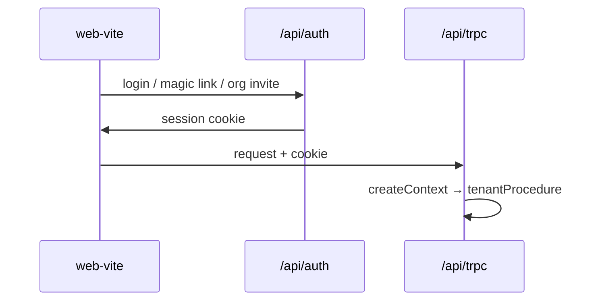

# Better Auth (staff)

> Portal auth is separate — [[portal-auth]]. Do not mix session models.

## Purpose

Staff users authenticate via Better Auth at `/api/auth/**`. Session drives `tenantProcedure`: `activeOrganizationId` and regional DB client.

## Flow



## Entry points

| Piece | Path |
|-------|------|
| Auth config | `packages/auth/src/config.ts` |
| Plugins | organization, admin, magic-link |
| Roles/AC | `packages/auth/src/roles.ts`, `permissions.ts` |
| Fastify mount | `apps/api/src/plugins/auth.ts` |
| tRPC context | `packages/api/src/context.ts` → `createContext()` |
| Tenant middleware | `packages/api/src/middleware/tenant.ts` |
| Staff UI auth | `apps/web-vite/src/components/auth/` |

## Invariants

- `organizationId` from `ctx.session.session.activeOrganizationId` — never client input alone
- Organization plugin handles invites, active org switching
- Lockout: failed login attempts capped in auth config
- Emails via Resend adapters in `packages/auth/src/auth-emails.ts`

## Related

- [[portal-auth]]
- [[tenant-and-audit]]
- [[rbac-permissions]]
- [[multi-region-db]]

## Verify live

```bash
semble search "createContext"
semble search "activeOrganizationId"
cat packages/auth/src/config.ts | head -30
```

## Agent mistakes

- Using portal_session for staff routes
- Trusting `organizationId` from tRPC input without session
- Confusing Better Auth org roles with workflow role templates ([[rbac-permissions]])
