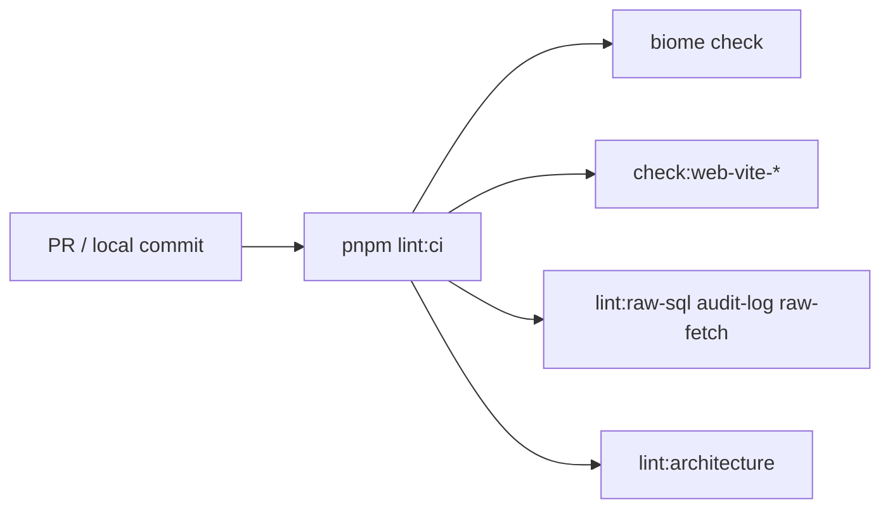

# CI and lint guards

> **Do not cite guard names from memory.** Verify `package.json` scripts.

## Purpose

Repo enforces architecture and security via scripted guards in `pnpm lint:ci`. Agents must run relevant guards after touching guarded surfaces.

## Flow



## Entry points

| Guard | Script | Catches |
|-------|--------|---------|
| `lint:architecture` | `scripts/lint-architecture.mjs` | inline entityId, local formatAmount, db in web-vite |
| `check:web-vite-data-layer` | `check-web-vite-data-layer.mjs` | tRPC in pages/containers |
| `check:web-vite-page-shells` | `check-web-vite-page-shells.mjs` | pages import non-containers |
| `check:web-vite-presentational` | `check-web-vite-presentational.mjs` | hooks in presentational files |
| `check:web-vite-table-pattern` | `check-web-vite-table-pattern.mjs` | non-workbench DataTable |
| `check:web-vite-dialog-pattern` | `check-web-vite-dialog-pattern.mjs` | dialog layering |
| `lint:audit-log` | `lint-audit-log.mjs` | sensitive mutations without audit |
| `lint:raw-sql` | `check-raw-sql-tenant-scoped.ts` | unscoped raw SQL |
| `lint:raw-fetch` | `lint-raw-fetch.mjs` | raw fetch in API |
| `lint:idempotency` | `lint-idempotency.mjs` | webhook idempotency gaps |
| `lint:silent-catch` | `lint-silent-catch.mjs` | empty catch blocks |
| `lint:logs` | `lint-logs.mjs` | console.* in app source |
| `lint:i18n-casts` | `lint-i18n-casts.ts` | unsafe i18n key casts |
| `check:rtl-logical-props` | `check-rtl-logical-props.mjs` | physical L/R CSS for RTL |
| `lint:region-leakage` | db package | cross-region data leaks |
| `check:webhook-routes` | `check-webhook-routes.mjs` | webhook route hygiene |
| `check:no-process-env` | `check-no-process-env.mjs` | raw process.env in apps |

## Invariants

- Full CI gate: `pnpm lint:ci` (aggregates above)
- Typecheck canonical: `pnpm typecheck` — run filtered after `packages/*` API changes
- web-vite: also `pnpm typecheck --filter=@contractor-ops/web-vite` locally (may not be in all CI workflows — see [[decisions/tech-debt-hotspots]])

## Related

- [[web-vite-data-layer]]
- [[entity-id-and-money]]
- [[tenant-and-audit]]
- [[i18n-and-locales]]

## Verify live

```bash
pnpm lint:ci
grep lint:ci package.json
```

## Agent mistakes

- Skipping guards after "small" router/UI change
- Adding payment procedures without `lint:audit-log` check
- Empty `catch {}` in integrations — guard may miss excluded roots
