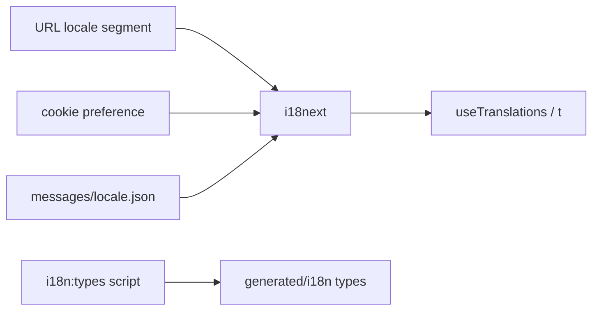

# i18n and locales

> **Do not cite locale list from memory.** Verify `apps/web-vite/src/i18n/messages.ts`.

## Purpose

Staff SPA supports multiple locales (en, de, pl, ar RTL) via i18next + ICU. URL `:locale` segment is source of truth; typed keys generated for `t()`.

## Flow



## Entry points

| Piece | Path |
|-------|------|
| Bootstrap | `apps/web-vite/src/i18n/index.ts` |
| Locales + loaders | `apps/web-vite/src/i18n/messages.ts` |
| Message files | `apps/web-vite/messages/{en,de,pl,ar}.json` |
| Typed keys | `apps/web-vite/src/i18n/typed-keys.ts` |
| Generated types | `apps/web-vite/src/generated/i18n/` |
| Typegen | `scripts/generate-i18n-types.ts` → `pnpm i18n:types` |
| RTL guard | `pnpm check:rtl-logical-props` |
| i18n cast lint | `pnpm lint:i18n-casts` |
| Hooks | `use-translated-error.ts`, `useFormatter.ts` |

## Invariants

- Turbo `test` / `typecheck` depend on `i18n:types` — stale generated types break builds
- RTL (ar): use logical CSS properties — not physical `left`/`right` alone
- Legal locked phrases: `packages/validators/src/legal/` — not duplicated in message JSON ad-hoc

## Related

- [[ci-guards]]
- [[validators-boundaries]]
- [[web-vite-data-layer]]
- [[decisions/tech-debt-hotspots]]

## Verify live

```bash
pnpm i18n:types
pnpm check:rtl-logical-props
pnpm lint:i18n-casts
grep SUPPORTED_LOCALES apps/web-vite/src/i18n/messages.ts
```

## Agent mistakes

- Hardcoded UI strings in components instead of `t('key')`
- Deleting or skipping `i18n:types` after adding keys
- Physical margin/padding breaking Arabic RTL layout
