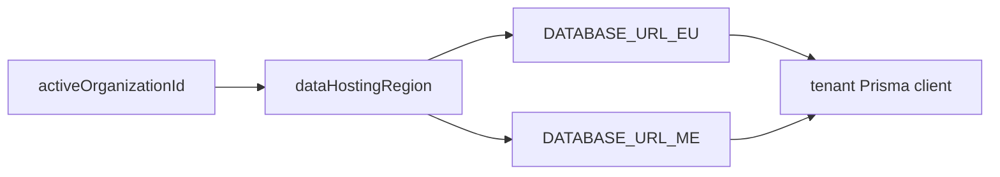

# Multi-region database

## Purpose

Orgs hosted in EU or ME (Gulf) regions. Prisma clients routed by org `dataHostingRegion`.

## Flow



## Entry points

| Piece | Path |
|-------|------|
| Region routing | `packages/db/src/region.ts` |
| Pool + logging | `packages/db/src/client.ts` |
| RLS | `packages/db/src/rls.ts` |
| Migrations | `packages/db/scripts/migrate-all-regions.ts` |
| R2 regional | `packages/api/src/services/regional-storage.ts` |

## Invariants

- `withRlsReads` / `withRlsTransactions` for tenant isolation
- Raw SQL must be tenant-scoped — `pnpm lint:raw-sql`
- `rls.ts` also exports `allowAuditPurge(tx)` — opts a transaction into the gated `AuditLog` DELETE policy (GDPR erasure only); see [[audit-log]]

## Related

- [[tenant-and-audit]]
- [[integrations/neon-r2]]
- [[structure/prisma-schema-areas]]

## Verify live

```bash
semble search "DATABASE_URL_EU"
pnpm lint:raw-sql
```

## Agent mistakes

- Single global DB assumption for all orgs
- `$executeRaw` without tenant guard
