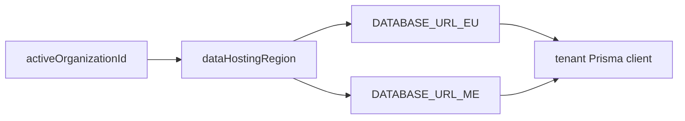

# Multi-region database

## Purpose

Orgs hosted in EU or ME (Gulf) regions. Prisma clients routed by org `dataHostingRegion`.

## Flow



## Entry points

| Piece | Path |
|-------|------|
| Region routing | `packages/db/src/region.ts` |
| Pool + logging | `packages/db/src/client.ts` |
| RLS | `packages/db/src/rls.ts` |
| Migrations | `packages/db/scripts/migrate-all-regions.ts` |
| R2 regional | `packages/api/src/services/regional-storage.ts` |

## Invariants

- `withRlsReads` / `withRlsTransactions` for tenant isolation
- Raw SQL must be tenant-scoped — `pnpm lint:raw-sql`
- `rls.ts` also exports `allowAuditPurge(tx)` — opts a transaction into the gated `AuditLog` DELETE policy (GDPR erasure only); see [[audit-log]]

## Migrations (deploy)

- App-schema migrations run on **every `api-server` deploy** via its Render
  `preDeployCommand: pnpm --filter @contractor-ops/db run db:migrate:all`. A
  non-zero exit aborts the rollout (previous revision keeps serving). No other
  app service migrates; `cms` runs its own Payload migrations on the `cms`
  deploy.
- `migrate-all-regions.ts` iterates `EU`/`ME`/`US`, skips a region with no
  `DATABASE_URL_<region>`, and runs `prisma migrate deploy` per region. It
  **prefers `DIRECT_URL_<region>`** (the region's unpooled Neon endpoint),
  falling back to the pooled `DATABASE_URL_<region>`. Rationale: migration DDL +
  advisory locks hang over Neon's PgBouncer pooler.
- Prisma 7 **removed the schema `directUrl` field** (`P1012` if present); the
  datasource `url` lives in `packages/db/prisma.config.ts` (`env('DATABASE_URL')`)
  and is CLI-only. The direct endpoint is therefore injected by setting
  `DATABASE_URL` in the migrate CLI child's env — runtime is unaffected because
  the app connects through `@prisma/adapter-pg` (`client.ts`), not the datasource
  URL.

## Related

- [[tenant-and-audit]]
- [[integrations/neon-r2]]
- [[structure/prisma-schema-areas]]

## Verify live

```bash
semble search "DATABASE_URL_EU"
pnpm lint:raw-sql
```

## Agent mistakes

- Single global DB assumption for all orgs
- `$executeRaw` without tenant guard
