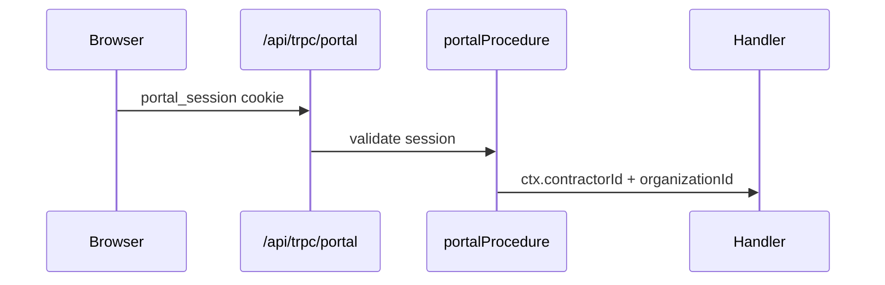

# Portal auth

## Purpose

One portal, one magic-link + cookie session, isolated from staff Better Auth + `tenantProcedure`. The session authenticates a **discriminated subject** — a Contractor OR an employee `Worker(EMPLOYEE)`. `validatePortalSession` loads both relations in one `findUnique` and branches on the stored `subjectType`; the contractor path is byte-for-byte preserved (regression-fenced).

## Flow



## Entry points

| Piece | Path |
|-------|------|
| Router | `packages/api/src/portal-root.ts` |
| Middleware | `packages/api/src/middleware/portal-auth.ts` |
| Contractor procedure | `portalProcedure` — sets `ctx.contractorId` + `ctx.contractor` (never `workerId`) |
| Employee procedure | `portalEmployeeProcedure` — sets `ctx.workerId` + `ctx.worker` + `ctx.employeeProfile` (never `ctx.contractorId`); asserts `module.employee-portal` |
| Manager procedure | `portalManagerProcedure` — extends the employee procedure + asserts ≥1 direct report (`EmployeeProfile.managerWorkerId = ctx.workerId`) |
| Session service | `packages/api/src/services/portal-session.ts` — discriminated `createPortalSession` + `validatePortalSession` |
| Magic-link resolution | `packages/api/src/services/portal-magic-link.ts` — `findContractorsByEmail` + `findEmployeesByEmail`; verify returns the subject union for the org-picker |
| Merged portal router | `packages/api/src/routers/portal/portal.ts` |
| Mount | `apps/api/src/plugins/trpc.ts` — portal **first** |

## UI surface

`apps/web-vite/src/components/portal/`, routes in `router/portal-routes.tsx`.

## Invariants

- Portal procedures **not** in `appRouter` — smaller `AppRouter` type for dashboard
- `portal` + `portalTime` namespaces only on portal mount
- **Subject fence:** an employee handler sees ONLY `ctx.workerId`, never `ctx.contractorId` (and vice versa). The `PortalSession` one-of CHECK guarantees a row is exactly one subject; `validatePortalSession` rejects TERMINATED/deleted employees and ARCHIVED/INACTIVE contractors.
- Magic-link never enumerates: `requestMagicLink` returns `{ success: true }` whether or not a contractor OR employee matched.

## Related

- [[better-auth-staff]] — staff uses separate Better Auth session
- [[domains/portal-external]]
- [[structure/api-routers-catalog]]
- [[tenant-and-audit]]

## Verify live

```bash
semble search "portalProcedure"
semble search "portal_session"
```

## Agent mistakes

- Adding portal endpoints to `root.ts`
- Reusing staff session helpers in portal routers
