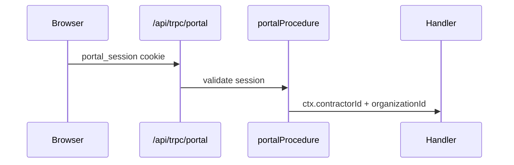

# Portal auth

## Purpose

Contractor portal uses a separate router and cookie session — isolated from staff Better Auth + `tenantProcedure`.

## Flow



## Entry points

| Piece | Path |
|-------|------|
| Router | `packages/api/src/portal-root.ts` |
| Middleware | `packages/api/src/middleware/portal-auth.ts` |
| Session service | `packages/api/src/services/portal-session.ts` |
| Merged portal router | `packages/api/src/routers/portal/portal.ts` |
| Mount | `apps/api/src/plugins/trpc.ts` — portal **first** |

## UI surface

`apps/web-vite/src/components/portal/`, routes in `router/portal-routes.tsx`.

## Invariants

- Portal procedures **not** in `appRouter` — smaller `AppRouter` type for dashboard
- `portal` + `portalTime` namespaces only on portal mount

## Related

- [[better-auth-staff]] — staff uses separate Better Auth session
- [[domains/portal-external]]
- [[structure/api-routers-catalog]]
- [[tenant-and-audit]]

## Verify live

```bash
semble search "portalProcedure"
semble search "portal_session"
```

## Agent mistakes

- Adding portal endpoints to `root.ts`
- Reusing staff session helpers in portal routers
