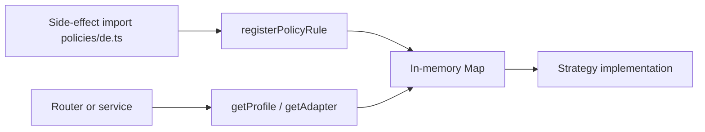

# Registry plug-in pattern

## Purpose

Extend behavior (provider, jurisdiction, export type, operator) **without editing a central switch**. New plug-ins register on import; callers resolve via `getX(id)` at runtime.

## When to use

| Use registry | Keep inline switch |
|--------------|-------------------|
| 3+ variants with same contract | One-off branch |
| New variants added frequently (providers, jurisdictions) | Stable two-way fork with no extension path |
| Test needs to swap/mock implementation | Hot path with zero extension |

## Contract (repo convention)

1. **`registerX(plugIn)`** — side-effect import or explicit call from `register-all.ts`
2. **`getX(id)`** — fail-fast (`throw`) or return `undefined` when empty is valid
3. **`clearX()`** — for Vitest isolation (call from test `beforeEach`)
4. **Zod at boundary** — params validated before handler runs (exports, outbox)
5. **No shared mutable singleton for per-request tokens** — factory new instance + `withAccessToken` / `withOrgGridToken` (IdP saga)

## Existing registries

| Registry | Package | Resolves |
|----------|---------|----------|
| Provider adapters | `packages/integrations/src/registry.ts` | OAuth/webhook integrations |
| OCR adapters | same file | Claude Vision (no IntegrationConnection) |
| Company registry | same file | Dataport, GUS BIR1 |
| Deprovisionable | same file | GWS, Slack, Entra, Okta, GitHub |
| User source | `packages/integrations/src/services/user-source-registry.ts` | Onboarding directory fetch (JIRA/LINEAR/GWS/SLACK); Zod in `user-source-schemas.ts`; `MAX_USER_SOURCE_PAGES=100`; `registerBuiltInUserSourceFetchers()` for tests |
| Calendar provider | `packages/integrations/src/services/calendar-provider-registry.ts` | Google/Outlook event adapters |
| Classification profiles | `packages/classification/src/registry.ts` | IR35, Scheinselbständigkeit |
| Compliance policies | `packages/compliance-policy/src/registry.ts` | Per-jurisdiction payment rules |
| E-invoice profiles | `packages/einvoice/src/registry.ts` | XRechnung, ZUGFeRD, KSeF, ZATCA |
| Async exports | `packages/api/src/services/exports/registry.ts` | CSV/PDF export jobs |
| Outbox handlers | `packages/api/src/services/outbox/handlers.ts` | Post-commit side effects |
| Approval operators | `packages/api/src/services/approval-engine/operators/registry.ts` | Workflow evaluators |
| Tax ID validators | `packages/api/src/services/tax-id-validators/registry.ts` | HMRC/VIES per `taxIdType` |
| Jurisdiction resolver | `packages/compliance-policy/src/jurisdiction-resolver.ts` | ISO/country → jurisdiction (single source) |
| Compliance doc registry | `packages/compliance-policy/src/doc-registry.ts` | `registerComplianceDoc` on import |
| IDP deprovision factory | `packages/integrations/src/idp/create-configured-deprovisionable.ts` | Fresh GWS/Slack adapter per saga step |

## Flow



## Entry points (add a new plug-in)

| Adding… | Steps |
|---------|-------|
| Integration provider | `BaseAdapter` subclass → `registerAdapter` in `register-all.ts` |
| Onboarding user source | `UserSourceFetcher` → `registerUserSourceFetcher`; validate responses in `user-source-schemas.ts`; cap pagination at 100 pages |
| Jurisdiction compliance rule | `policies/xx.ts` → `registerPolicyRule` on import |
| Export type | `defineExport` in `exports/registry.ts` + handler in outbox |
| Tax ID validator | `TaxIdValidator` → `registerTaxIdValidator` (API package) |

## Shared loaders (API)

| Helper | Path | Role |
|--------|------|------|
| `loadIntegrationConnection` | `packages/api/src/lib/integration-connection.ts` | By `connectionId` + `organizationId`; optional `provider`; `requireConnected` (default `true`) |
| `loadOrgIntegrationConnection` | same file | By `organizationId` + `provider`; `status` (value, array, or `'any'`); `optional: true` → `null`; `notFoundMessage` override |
| `jurisdiction-resolver` | `packages/compliance-policy/src/jurisdiction-resolver.ts` | ISO/country → jurisdiction (single source) |

All `packages/api/src/routers/integrations/*` use these loaders — no inline `findFirst` for connection rows.

## `integrationProcedure` factory

| Helper | Path | Role |
|--------|------|------|
| `integrationProcedure` | `packages/api/src/lib/integration-procedure.ts` | Shared tRPC procedure factory for integration routers |
| `integrationSettingsProcedure` | same file | Convenience: `{ settings: [read\|update] }` + optional tier |

**Chain:** `tenantProcedure` → optional `requirePermission` → optional `requireTier` → handler.

**Options:** `{ permission?: Permission; tier?: SubscriptionTier }` — both optional.

**Procedure counts** (verify in `packages/api/src/routers/integrations/`):

| Router | `integrationProcedure` / `integrationSettingsProcedure` count |
|--------|----------------------------------------------------------------|
| `jira.ts` | 11 |
| `linear.ts` | 9 |
| `teams.ts` | 6 |
| `google-workspace.ts` | 5 |
| `peppol.ts` | 9 |
| `ksef.ts` | 5 |
| `deprovisioning.ts` | 10 |

No plain `tenantProcedure` in `packages/api/src/routers/integrations/*`. OAuth connect paths for Google Workspace live outside these counted procedures.

**When adding integration routes:** prefer `integrationProcedure` or `integrationSettingsProcedure`; load connections via `loadIntegrationConnection` / `loadOrgIntegrationConnection`.

## TypeScript — `erasableSyntaxOnly` (secrets)

Repo base tsconfig sets `erasableSyntaxOnly: true`. Constructor **parameter properties** (`constructor(private readonly x)`) are not erasable.

**Fix applied:** `packages/secrets/src/cached-store.ts` — explicit `this.backing = backing` assignment instead of param property on `CachedStore` constructor (was blocking `@contractor-ops/secrets` typecheck upstream of API).

## Agent mistakes

- `switch (provider)` in API service when `integrations/registry` already exists
- Reusing registry **singleton** adapter with `withAccessToken` under concurrent requests — use **factory** (`createConfiguredDeprovisionableAdapter`)
- Forgetting `clearX()` in tests → Vitest worker leakage
- Breaking export `type` string — pending QStash jobs fail on claim

## Related

- [[integrations/_index]]
- [[tenant-and-audit]]
- [[validators-boundaries]]
- `.planning/codebase/CONVENTIONS.md` § Registry plug-in pattern

## Verify live

```bash
semble search "registerAdapter"
semble search "registerProfile"
pnpm test --filter=@contractor-ops/integrations
pnpm test --filter=@contractor-ops/api
```
