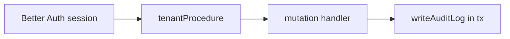

# Tenant scope and audit

## Purpose

Multi-tenant isolation from session context; append-only audit trail on sensitive mutations.

## Flow



## Entry points

| Concern | Path |
|---------|------|
| Staff tenant | `packages/api/src/middleware/tenant.ts` |
| Context | `packages/api/src/context.ts` |
| Audit writer | `packages/api/src/services/audit-writer.ts` |
| Audited wrapper | `packages/api/src/lib/audited-mutation.ts` |
| Audit reads | `packages/api/src/routers/core/audit.ts` |

## Invariants

- `organizationId` from `ctx.session.session.activeOrganizationId` — **never** client alone
- Pass `tx` to `writeAuditLog` inside `$transaction`
- AuditLog append-only — enforced at the DB level (UPDATE always rejected by trigger; DELETE only inside a tx that calls `allowAuditPurge`, used solely by GDPR erasure). See [[audit-log]]
- `pnpm lint:audit-log` on sensitive models

## Related

- [[audit-log]] — mutation checklist + `pnpm lint:audit-log`
- [[multi-region-db]]
- [[trpc-procedure-stack]]
- [[domains/invoice-to-payment]]

## Verify live

```bash
pnpm lint:audit-log
semble search "writeAuditLog"
```

## Agent mistakes

- Trusting `organizationId` from tRPC input without session check
- Payment mutations without audit — see [[decisions/tech-debt-hotspots]]
