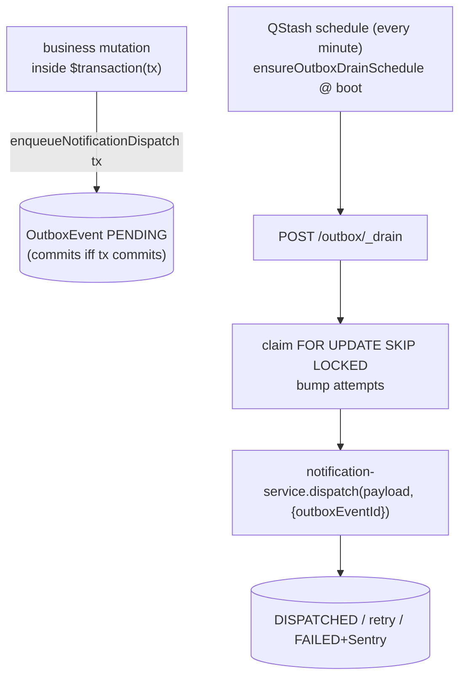

# Transactional outbox

## Purpose

Deliver a side effect (today: notification fan-out) **exactly-once as a consequence of a DB write**, surviving a crash between commit and dispatch. Replaces the legacy post-commit `dispatch(...)` calls, which were **at-most-once** — a process death (or a swallowed error) after the business tx committed simply dropped the notification.

## How it works



- **Producer** calls `enqueueNotificationDispatch({ tx, event, dedupKey? })` (`services/outbox/index.ts`) **inside** the same `$transaction` as the business write. The `OutboxEvent` row is durable iff the tx commits; on rollback nothing was ever queued.
- **Drain** (`drainOutboxBatch`) claims up to 100 rows under `FOR UPDATE SKIP LOCKED`, dispatches each **outside** any tx, then finalizes DISPATCHED / retry (exp backoff + jitter, 5 attempts) / FAILED (+Sentry).
- **Exactly-once** rides on the `OutboxEvent.id`: the `notification.dispatch` handler threads it into `dispatch(payload, { outboxEventId })`, which keys `Notification.dedupKey = ${outboxEventId}:${userId}` and Resend's `Idempotency-Key` off it — so a re-drive collapses to one delivery.
- **Schedule** is global (not per-tenant): `ensureOutboxDrainSchedule` (`apps/api/src/lib/outbox-drain-schedule.ts`) upserts one QStash schedule (fixed `scheduleId: 'outbox-drain'`) at API boot and asserts it by read-back. Non-fatal: missing `QSTASH_TOKEN` (local dev) or a QStash outage logs + Sentry, never aborts boot. Contrast the per-tenant KSeF/Peppol/Google-Workspace schedules created inside their connect procedures.

## When to use

Any notification (or future side effect) that **must** happen because a DB write happened, where losing it is a defect: approvals, invoices, billing entitlement changes. Enqueue inside the enclosing `$transaction`.

## When NOT to convert

Do **not** wrap a write in a new transaction just to enqueue. A pure post-event notification with no atomic business write to bind to (cross-org scans, digest crons, directory-diff notices) gains nothing from the outbox and forcing a tx is out of scope — leave it as a direct `dispatch(...)` until it naturally sits inside a tx.

## Adding a new event type

1. Add a literal to `OutboxEventType` + a payload entry to `OutboxEventPayloadMap` (`handlers.ts`).
2. Add a handler to `outboxHandlerRegistry` (throwing = transient → retry).
3. Producers enqueue via `enqueueOutboxEvent({ tx, eventType, payload })` (or a typed helper like `enqueueNotificationDispatch`).

## Invariants

- Enqueue **inside** the business `$transaction` — passing `tx` is the whole point.
- Handlers use `OutboxEvent.id` as the downstream idempotency key; re-delivery MUST be a no-op.
- The drain never shares a transaction with handler side effects (Resend/Slack/Stripe).
- The drain schedule is asserted at boot; a silent create no-op surfaces as an error, not a queue that never drains.

## Related

- [[domains/notifications-and-reminders]]
- [[integrations/qstash-cron]]
- [[structure/key-services]]

## Verify live

```bash
semble search "enqueueNotificationDispatch"
semble search "ensureOutboxDrainSchedule"
```

## Agent mistakes

- Enqueuing after the tx commits (defeats durability) instead of inside it.
- Leaving the post-commit `dispatch(...)` in place after converting → double delivery.
- Wrapping an unrelated write in a new tx just to use the outbox.
