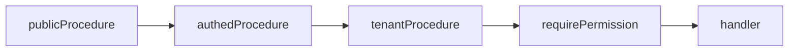

# tRPC procedure stack

## Purpose

Staff mutations chain middleware for auth, tenant scope, and RBAC before handlers run.

## Flow



Classification (when flag on): `tenantProcedure` → `classificationProcedure` → handler.

## Entry points

| Piece | Path |
|-------|------|
| Init + procedures | `packages/api/src/init.ts` |
| Context | `packages/api/src/context.ts` |
| Tenant | `packages/api/src/middleware/tenant.ts` |
| RBAC | `packages/api/src/middleware/rbac.ts` |
| mergeRouters | `packages/api/src/init.ts` |

## Invariants

- Every procedure has Zod `.input()`
- `organizationId` from `ctx.session.session.activeOrganizationId` — not raw client input
- Large domains split sub-routers → `mergeRouters` (invoice, payment, approval, portal)

## Rate-limit middlewares (per-user / per-org cost caps)

Upstash sliding-window limiters (in-memory fallback for dev/test; production
fail-CLOSED 503 on Redis outage). All share the same shape — `prefix`, `WINDOW_MS`,
a `__reset…ForTests` helper, and chain `.use(...)` after `authedProcedure`/`tenantProcedure`:

| Middleware | Key | Budget | Applied to |
|------------|-----|--------|------------|
| `upload-rate-limit` | per-user | 10/min | `document.requestUpload`/`uploadNewVersion`, invoice intake upload |
| `classification-rate-limit` | per-org + assessmentId | 120/min | `classification.saveAnswer` |
| `org-create-rate-limit` | per-user | 5/24h | `organization.create` |
| `report-rate-limit` | per-org (`report:${orgId}`) | 30/min | all `report.*` + `dashboard.*` (shared budget) |

Tests must clear `UPSTASH_REDIS_REST_*` in `vi.hoisted` (the test env ships placeholder
Upstash creds — otherwise the limiter hangs on a real Redis call) and reset the limiter
in `beforeEach`.

## Related

- [[tenant-and-audit]]
- [[portal-auth]]
- [[validators-boundaries]]
- [[structure/api-routers-catalog]]

## Verify live

```bash
semble search "tenantProcedure"
semble search "requirePermission"
```

## Agent mistakes

- Inline `z.object({ id: z.string() })` — use `entityIdSchema`
- Skipping `requirePermission` on staff mutations
