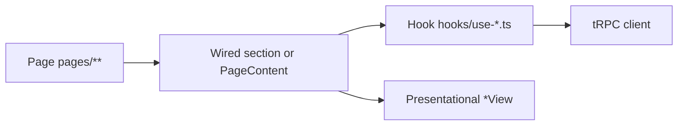

# web-vite data layer

> Full spec: `apps/web-vite/ARCHITECTURE.md`. Do not cite hook names from wiki alone.

## Purpose

Staff + portal SPA enforce a single tRPC/React Query boundary per UI section. Pages stay thin; data lives in domain hooks.

## Flow



## Entry points

| Layer | Path | tRPC allowed? |
|-------|------|---------------|
| Page | `apps/web-vite/src/pages/**` | **No** — `Suspense` + compose `*PageContent` or return wired root |
| Wired section | `components/{domain}/*.tsx` | **No** — calls hooks, picks variant |
| Hook | `components/{domain}/hooks/use-*.ts` | **Yes** — sole boundary |
| Presentational | `*View` or props-only `*.tsx` | **No** |
| Shared | `src/hooks/**` | Cross-cutting only |

There are **no** `*-container.tsx` modules. Passthrough wrappers were merged into wired exports in the same file as the view.

## Wired + View convention

```tsx
export function SectionView(props: SectionViewProps) { /* presentational */ }

export function Section() {
  const state = useSection();
  if (state.isLoading) return <SectionSkeleton />;
  if (!state.canView) return <Navigate to="/forbidden" replace />;
  return <SectionView {...state} />;
}
```

Route-level screens use `*PageContent` in `pages/**` (often co-located in the page file) with the same rules: may call domain hooks and branch, but not `useTRPC` directly.

## Invariants

- No `useTRPC` / `useQuery` / `useMutation` in pages or wired sections (CI: `pnpm check:web-vite-data-layer`)
- New features: hook first, then wired section + view, then page shell
- Tables: `@contractor-ops/ui` DataTable — see [[data-tables-workbench]]
- Billing tier gating: `BillingTierGate` in `billing/billing-tier-gate.tsx` (Stripe subscription). Unleash product flags: `layout/feature-gate.tsx` — different concern.

## Shared UI shells

| Shell | Path | Used by |
|-------|------|---------|
| `EntitySummarySheet` | `components/table-kit/entity-summary-sheet.tsx` | contractor, contract, invoice, payment-run, workflow, approval side panels |
| `WizardDialogShell` | `components/wizard/wizard-dialog-shell.tsx` | contract + contractor wizards |
| `FeatureGate` | `components/layout/feature-gate.tsx` | integrations provider sections (Unleash) |
| `useDirection` | `hooks/use-direction.ts` | RTL on sheets, wizards, workbench tables (`ar` locale) |

Provider sections (`*-provider-section.tsx`) already follow hook + skeleton + view in one file.

## List hook owns table state

Domain `use-*-list.ts` composes tRPC query + `useListDataTable` when the list hook owns filters and query. Presentational `data-table.tsx` receives sort/column/selection via props only.

| Domain hook | `storageKey` |
|-------------|--------------|
| `useContractorList` | `contractor-table-columns` |
| `useContractList` | `contract-table-columns` |
| `useInvoiceList` | `invoice-table-columns` |
| `useWorkflowRunsDataTable` | `workflow-runs-table-columns` |
| `useEquipmentTable` | `equipment-table-columns` |
| `useReportTableState` | `report-table-columns` |

## Related

- [[structure/web-vite-domains]]
- [[trpc-procedure-stack]]
- [[data-tables-workbench]]

## Verify live

```bash
pnpm check:web-vite-data-layer
pnpm check:web-vite-page-shells
pnpm check:web-vite-presentational
find apps/web-vite/src -name '*-container.tsx'   # expect empty
```

## Agent mistakes

- Putting `useTRPC` in wired sections during "quick fixes"
- Tests importing wired export when asserting props — use `*View`
- Mocking deleted `*-container` paths in vitest
- Confusing `FeatureGate` (Unleash) with `BillingTierGate` (subscription tier)
- Importing `@contractor-ops/db` in web-vite
