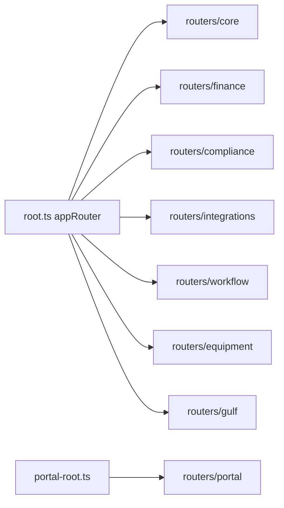

# API router groups

## Purpose

`packages/api/src/routers/` organizes tRPC procedures by domain folder. Large namespaces use `mergeRouters` in `packages/api/src/init.ts`.

## Flow



## Entry points

| Folder | Namespaces (high level) | Notes |
|--------|-------------------------|-------|
| `core/` | organization, user, contractor, contract, approval, audit, time, document, tax, taxForm, … | `organizationDefinitions` nests team/project/costCenter; `taxForm` (staff US W-form read/track) flag-gated on `module.us-expansion`; `contractor.create` surfaces a duplicate `taxId` (within an org) as tRPC `CONFLICT` via a `P2002` guard, not a 500 — see [[domains/contractors-engagements]] |
| `finance/` | invoice, invoiceIntake, payment, billing, skonto, bacs, … | payment/invoice split into sub-modules |
| `compliance/` | complianceAdmin, gdpr, consent, zatca, gulf, einvoice, tax + 8 conditional classification* | classification flag-gated |
| `integrations/` | integration, jira, linear, ksef, peppol, googleWorkspace, teams | OAuth via integration framework |
| `workflow/` | workflow, workflowRoles | KT role templates |
| `equipment/` | equipment | shipments, carriers |
| `portal/` | portal, portalTime | **Not** in appRouter — see portal-root |
| `public-api/` | REST callers only | Hono surface |

## Related

- [[api-routers-catalog]]
- [[patterns/trpc-procedure-stack]]
- [[decisions/arch-decisions]]

## Verify live

```bash
semble search "mergeRouters"
ls packages/api/src/routers/
```

## Agent mistakes

- Adding portal procedures to `root.ts` — use `portal-root.ts`
- Flat 2000-line router files — split + merge pattern exists
