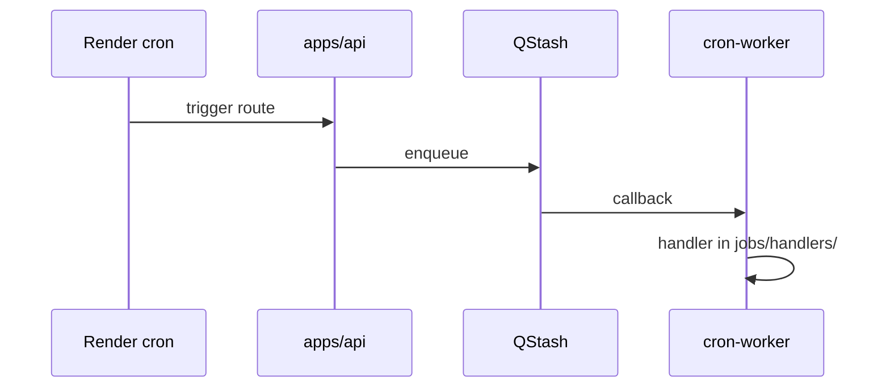

# Cron worker jobs

## Purpose

`apps/cron-worker` runs QStash-triggered and scheduled background work. Shared business logic stays in `packages/api/src/services/`.

## Flow



## Entry points

| Handler | Path | Domain |
|---------|------|--------|
| `exchange-rates.ts` | ECB daily rates | [[integrations/einvoice-profiles]] |
| `boe-rate-poll.ts` | BoE base rate | [[domains/payments-and-bank-files]] |
| `compliance-reminder.ts` | compliance renewals — shared scan entry (`executeComplianceReminderScan`) run via the `reminders` fan-out, not a standalone registered job | [[domains/compliance-dashboard]] |
| `classification-economic-dependency.ts` | §2 SGB VI scan | [[domains/classification-ir35]] |
| `form-1099k-tracker.ts` | informational 1099-K band scan (`module.us-expansion`; never files) | [[domains/us-tax-forms]] |
| `year-end-1099-reminder.ts` | notify-only 1099-NEC batch-due reminder (`module.us-expansion`; **never generates or transmits**; mid-January, deduped per tax year) | [[domains/us-tax-year-end-filing]] |
| `classification-reassessment-triggers.ts` | IR35 triggers | [[domains/classification-ir35]] |
| `reminders/` + `drv-clearance-expiries.ts` | DRV expiry | [[domains/classification-ir35]] |
| `reminders/wt-limit-scan.ts` (`runWtLimitScan`) | daily working-time-limit scan — region fan-out, per-worker rolling weekly average, ONE `employee.wt_limit_breach` digest per recipient/day (region-prefixed dedup key); `module.workforce-employees` | [[domains/leave-and-time]] |
| `reminders/index.ts` (+ `drv-clearance-expiries.ts`) | reminder-rule fan-out, overdue workflow tasks, DRV expiry | [[domains/notifications-and-reminders]] |
| `reminders/index.ts` (+ `drv-clearance-expiries.ts`, `approval-sla.ts`) | reminder-rule fan-out, overdue workflow tasks, DRV expiry, approval-SLA escalation | [[domains/notifications-and-reminders]] |
| `token-refresh.ts` | OAuth token refresh | [[integrations/framework-core]] |
| `org-definition-sync.ts` | org definitions | [[domains/settings-and-org-admin]] |
| `hris-sync.ts` (`runScheduledHrisSync`, `CRON_HRIS_SYNC_SCHEDULE` hourly) | HRIS two-way sync — fan-out over CONNECTED Personio/BambooHR connections, `lastSyncAt` throttle, per-connection `tenantStore.run` pull | [[domains/hris-sync]] |
| `trial-notifications.ts` | billing trial | [[domains/billing-and-feature-gates]] |
| `stripe-reconcile.ts` | daily Stripe subscription status/tier drift repair (`0 1 * * *`; `CRON_STRIPE_RECONCILE_SCHEDULE`) | [[integrations/stripe-billing]] |
| `data-purge.ts` | GDPR retention | [[domains/consent-gdpr-pdpl]] |
| `inpost-status-poll.ts` | courier polling | [[domains/equipment-logistics]] |
| `late-interest-pdf-reaper.ts` | LPC PDF cleanup | [[domains/payments-and-bank-files]] |
| `job-health.ts` | cron monitor | [[integrations/qstash-cron]] |

## Invariants

- **The runner (`jobs/runner.ts`) guards every job in one place, not per handler.** Each tick gets: (1) an **in-process overlap guard** — a `Set` of in-flight job names; a tick whose previous run is still running is skipped + WARN-logged (`cron.tick.skipped_overlap`); (2) a **per-tick Postgres advisory lock** `pg_try_advisory_xact_lock('cron', jobName)` held for the whole handler by keeping its transaction open while the handler runs on separate pool connections — a second replica that can't acquire it skips the tick (`cron.tick.skipped_locked`); (3) a **hard wall-clock timeout** (`maxMs`, per-job in `jobs/job-meta.ts`, default `CRON_JOB_DEFAULT_MAX_MS`=5 min) via `Promise.race` — a hung handler is abandoned and a `cron.outcome=timeout` message is sent to Sentry (the handler keeps running on its pool connections since JS can't cancel a promise; the guard releases so the next tick may retry). `reminders` self-locks on its own `cron:reminders` key inside its handler — a distinct key from the runner's `cron:<jobName>`, so they never collide.
- **Per-job last-success is persisted, not in-memory.** The runner upserts `CronJobRunState` (`packages/db/prisma/schema/cron.prisma`, global/non-tenant, keyed `jobName @unique`) on every run — `lastRunAt` each tick, `lastSuccessAt` on success — so state survives a cron-worker restart (the in-memory `lastSuccessByJob` map, still served by `/health`, is wiped on restart, which used to hide missed ticks). On boot, `runStartupCatchUp` re-runs each **must-run daily job** (`catchUpOnBoot` in `job-meta.ts`) whose persisted `lastSuccessAt` predates one interval, so a restart that spanned a daily window doesn't silently skip a day.
- **`job-health.ts` alerts on a dead cron job, not just stale webhooks.** Alongside the `WebhookDelivery` reaper it reads every `CronJobRunState` row and, using the nominal cadence in `CRON_JOB_INTERVALS_MS` (`jobs/job-meta.ts`), fires a Sentry `alert.type=cron_job_stale` when `now - (lastSuccessAt ?? createdAt) > 2 × interval` for a job (a scheduler that silently stopped firing a job is otherwise undetectable). Jobs without a known interval are skipped; the staleness check is isolated in its own try/catch so it can't abort the webhook reaper.
- `createCronLogger` — no `console.*`
- **`data-purge.ts` runs once PER configured region — the single frankfurt cron-worker is not DB-blind.** It iterates `SUPPORTED_REGIONS`, resolving each region's base writer via `getRegionalClient(region)` and running the full retention pass (documents + R2, invoices, contracts, contractors, personnel files) against that region's DB — so ME (and future US) soft-deletes + GDPR erasures are finalised, not just the `DATABASE_URL` region. A region whose `DATABASE_URL_<region>` is unset (e.g. US locally) throws in `getRegionalClient` and is **skipped** (surfaced in `details.regionsSkipped`); a failure in one region is Sentry-captured with a `purge.region` tag and does not abort the others. R2 cleanup uses `deleteRegionalObject(key, region)` (region passed explicitly — the cron has no `tenantStore` context) so blobs are deleted from the org's regional bucket, never the legacy default. Runs on the **base** (non-soft-delete) client, so every `deleteMany` is a true DELETE gated by the per-model retention cutoff (`getRetentionCutoff`) — a statutorily retained model (`Form1099Nec` 4yr, akta osobowe windows) is never destroyed early.
- QStash routes: `defineQStashRoute` + Zod body (`apps/api/src/lib/qstash-route.ts`)
- `cronProcedure` with `Authorization: Bearer CRON_SECRET`
- **Reminders handler is crash-safe and overlap-safe.** `reminders/index.ts` fans out its sub-jobs inside one `pg_advisory_xact_lock('cron','reminders')` transaction and runs every read/write on that lock-holding `tx` connection — a tx-timeout that drops the lock also aborts the work, instead of letting it continue on a second pool connection past the released lock. A `ReminderInstance` row is skipped only once `status='SENT'`; a row left `PENDING` (a prior tick's `dispatch` threw before the SENT transition) is **re-dispatched** next tick, so a failed notification is never lost behind the `(reminderRuleId, entityType, entityId, scheduledFor)` unique. Each rule runs in its own try/catch and each fan-out sub-job in a `runIsolated` wrapper, so one poison rule/org can't abort the remaining rules or the sibling sub-jobs (`detectOverdueTasks`, DRV sweep, `detectOverdueApprovals`).
- **Approval-SLA breaches are escalated by this cron, not just shown in the UI.** `reminders/approval-sla.ts` (`detectOverdueApprovals`) mirrors `detectOverdueTasks`: it finds PENDING `ApprovalStep` rows past `slaDeadline`, nudges the assigned approver (24h Notification-table dedup), and after N daily breaches escalates once (guarded by `claimCronNotificationDedup`) to the next chain step's approver. It only notifies — flow-state transitions stay owned by the approval engine (see [[domains/approvals-engine]]).
- **User-facing notification copy is i18n, never hardcoded English.** Cron handlers pass dotted `Notifications.*` keys (into `apps/web-vite/messages/<locale>.json`) as `dispatch({ title, body, metadata })`. `dispatch`'s `resolveEventCopy` resolves them against the org's `Organization.language` (single locale per org, resolved at write time), with `metadata` supplying `{placeholder}` params — used by `reminders/` (contract/invoice/task) and `drv-clearance-expiries.ts`.
- **Bespoke cron emails** that bypass the React-Email pipeline (`trial-notifications.ts` → `sendAppEmail` raw HTML) resolve copy directly via `resolveMessage(key, normalizeLocale(org.language))` from `@contractor-ops/api/i18n/email-i18n` — the same bundle reader the email templates use.
- **`stripe-reconcile.ts` is the entitlement-drift backstop, not the primary path.** Webhooks own subscription state; this daily job pages `stripe.subscriptions.list({ status: 'all' })` and repairs any `Subscription` row whose `status`/`tier` disagrees with Stripe (source of truth). It writes Stripe's value directly but **never touches `lastEventCreated`**, so the webhook out-of-order guard stays intact. Idempotent (a re-run is a no-op on matching rows) and no advisory lock — it makes no in-place decisions, only convergent writes. Reaches Stripe via `@contractor-ops/api/services/stripe-client` (lazy `getServerEnv()`) + `buildSubscriptionData` from `@contractor-ops/billing/webhook`.

## Related

- [[integrations/qstash-cron]]
- [[apps]]

## Verify live

```bash
ls apps/cron-worker/src/jobs/handlers/
semble search "defineQStashRoute"
```

## Agent mistakes

- Duplicating service logic in worker — call `packages/api` services
- Webhook verify fail-open — see [[decisions/tech-debt-hotspots]]
