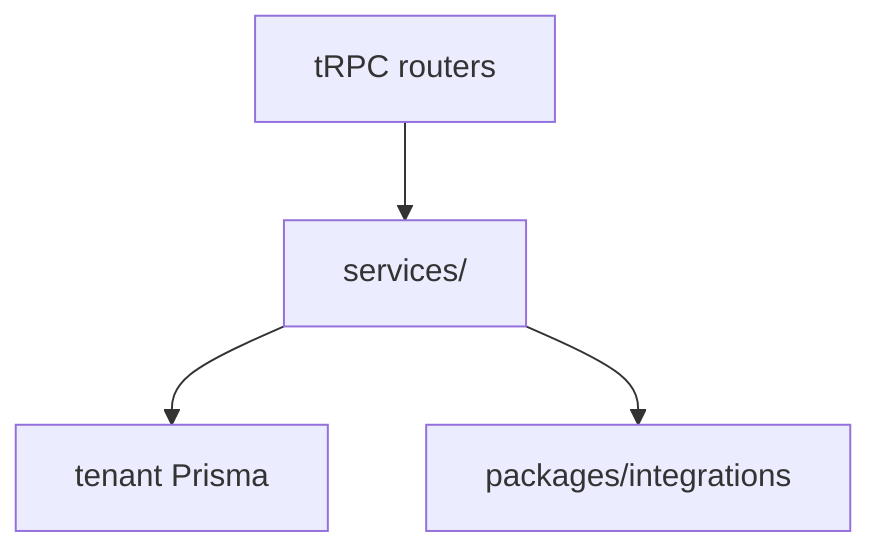

# Key API services catalog

> High-signal services only. Full list → `semble search` under `packages/api/src/services/`.

## Purpose

Shared business logic lives in `packages/api/src/services/` — routers should delegate here, not duplicate rules.

## Flow



## Entry points

| Service | Path | Domain |
|---------|------|--------|
| Invoice intake | `services/invoice-intake/` | [[domains/invoice-to-payment]] |
| Invoice matching | `services/invoice-matching.ts` | [[domains/invoice-to-payment]] |
| Approval engine | `services/approval-engine.ts` | [[domains/approvals-engine]] |
| Compliance payment gate | `services/compliance-payment-gate.ts` | [[domains/compliance-dashboard]] |
| Audit writer | `services/audit-writer.ts` | [[patterns/tenant-and-audit]] |
| Portal session | `services/portal-session.ts` | [[patterns/portal-auth]] |
| Notification dispatch | `services/notification-service.ts` | [[domains/notifications-and-reminders]] |
| E-sign orchestrator | `services/esign-orchestrator.ts` | [[integrations/docusign-esign]] |
| OCR extraction | `services/ocr-extraction.ts` | [[domains/documents-and-ocr]] |
| Peppol orchestrator | `services/peppol-orchestrator.ts` | [[integrations/peppol]] |
| Tax ID validation | `services/tax-id-validation.service.ts` | [[integrations/gov-api]] |
| Couriers | `services/courier/` | [[integrations/couriers]] |
| Outbox | `services/outbox/` | async delivery |
| Onboarding import | `services/onboarding-import-service.ts` | [[domains/onboarding-and-import]] — mergeByEmail, templates |
| Tenant find | `lib/tenant-find.ts` | scoped lookups |
| Audited mutation | `lib/audited-mutation.ts` | audit + tx wrapper |

## Invariants

- New domain logic → service first, thin router procedure
- Pass `tx` to `writeAuditLog` inside transactions

## Related

- [[api-router-groups]]
- [[meta/graphify]] — call graph for cross-service paths

## Verify live

```bash
node .claude/get-shit-done/bin/gsd-tools.cjs intel query invoice
ls packages/api/src/services/
```

## Agent mistakes

- 200-line business rules inline in router handler
- Duplicating compliance-gate checks outside `compliance-payment-gate.ts`
