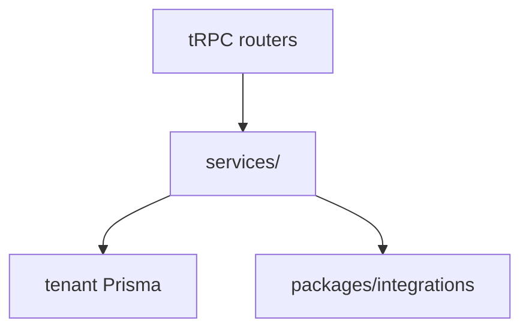

# Key API services catalog

> High-signal services only. Full list → `semble search` under `packages/api/src/services/`.

## Purpose

Shared business logic lives in `packages/api/src/services/` — routers should delegate here, not duplicate rules.

## Flow



## Entry points

| Service | Path | Domain |
|---------|------|--------|
| Invoice intake | `services/invoice-intake/` | [[domains/invoice-to-payment]] |
| Invoice matching | `services/invoice-matching.ts` | [[domains/invoice-to-payment]] |
| Approval engine | `services/approval-engine.ts` | [[domains/approvals-engine]] |
| Compliance payment gate | `services/compliance-payment-gate.ts` | [[domains/compliance-dashboard]] |
| Audit writer | `services/audit-writer.ts` | [[patterns/tenant-and-audit]] |
| API key service | `services/api-key-service.ts` | [[domains/public-api-surface]] — HMAC-SHA256 `co_live_*`/`co_test_*` gen/hash/verify + `resolveByPrefix` (grace-aware + **fail-closed on any environment↔`isSandbox` mismatch both ways**) + `appendApiKeyIpEvent` (bounded per-key source-IP log) |
| Sandbox provisioning | `services/sandbox-provisioning.ts` | [[domains/developer-experience]] — `provisionSandboxOrg` (idempotent, seeds a fixture contractor) + `issueSandboxKey` (mints a read-only `co_test_` key + audits) |
| Status aggregator | `services/status-aggregator.ts` | [[domains/developer-experience]] — `aggregateStatus()` maps the shipped health sources into 3 coarse component states + open-incident history; timeout-guarded, fail-safe, no tenant data (feeds `/v1/status.json`) |
| API tier limits | `lib/api-tier-limits.ts` | [[patterns/rate-limit]] — single source: monthly request quota (Starter 1k/Pro 10k/Ent ∞) + webhook-sub caps (defined; consumed in Phase 100) |
| API quota counter | `services/api-quota-counter.ts` | [[patterns/rate-limit]] — Upstash calendar-month counter `api-quota:{org}:{YYYY-MM}` (+ month-end TTL); in-memory non-prod fallback; `incrementMonthlyRequestCount` / read-only `getMonthlyRequestCount` |
| Portal session | `services/portal-session.ts` | [[patterns/portal-auth]] |
| Portal manager reports scope | `services/portal-reports.ts` | [[domains/employee-portal]] — `resolveDirectReports` / `assertIsDirectReport`: the employee-portal manager reporting-line scope, resolved SERVER-SIDE from `EmployeeProfile.managerWorkerId = ctx.workerId` (same org; the reference is deliberately not an FK so `organizationId` is enforced here). A manager may only read/act on their own direct reports; `assertIsDirectReport` throws FORBIDDEN before any state change |
| Notification dispatch | `services/notification-service.ts` | [[domains/notifications-and-reminders]] |
| E-sign orchestrator | `services/esign-orchestrator.ts` | [[integrations/docusign-esign]] |
| OCR extraction | `services/ocr-extraction.ts` | [[domains/documents-and-ocr]] — `processOcrExtraction` gated by `killswitch.ai-invoice-parser`; `resolveOrgRegion(orgId)` reads `Organization.dataRegion` (default EU) to pick the regional Unleash client (QStash callback carries no tenant ctx) |
| Peppol orchestrator | `services/peppol-orchestrator.ts` | [[integrations/peppol]] |
| ZATCA submission | `services/zatca-submission.ts` | [[integrations/zatca]] — advisory-locked hash-chain build → sign → submit; a transient failure (network/timeout/5xx/auth) stays PENDING, only a validation/4xx `ZatcaApiError` → REJECTED; an idempotent retry reuses the row's `zatcaUuid` instead of recreating it (no `@unique(invoiceId)` P2002); `reconcilePendingZatcaChains` is the `zatca-reconcile` cron backstop |
| Tax ID validation | `services/tax-id-validation.service.ts` | [[integrations/gov-api]] |
| US treaty rate | `services/treaty-rate.service.ts` | US treaty rate + article resolution (mirrors reverse-charge; 30% statutory default + reasoned override) |
| US W-form record | `services/tax-form.service.ts` | immutable W-9/W-8BEN/W-8BEN-E snapshot builder + supersede chain + expiry; full SSN never in snapshot |
| US form routing | `services/tax-form-routing.ts` | pure W-9 vs W-8BEN/W-8BEN-E determination from country + contractor type |
| US TIN-Matching | `services/tin-match.service.ts` | 24h cache + retry over the `TinMatchClient` seam; mismatch sets backup-withholding flag + escalates + audits, never hard-blocks; full TIN never logged/cached (mock default, live e-Services client dark) |
| US 1099-NEC engine | `services/form-1099-nec.service.ts` | box-1 aggregated by payment-date + FX-to-USD per recipient/payer-org (the box-1 conversion passes `FX_CONVERSION_MAX_AGE_DAYS` so a stale ECB rate throws, never silently mis-states a filed return); tax-year-keyed `Tax1099Threshold` gate (never a constant); box-4 backup withholding; CORRECTED = supersede in one tx; idempotent batch + audit; snapshot keeps TIN last-4 only |
| US 1099-NEC Copy-B PDF | `services/form-1099-nec-pdf.ts` + `pdf-templates/form-1099-nec-copy-b.tsx` | lazy `renderToBuffer` substitute Copy B (Pub 1179 §4.6) from the immutable snapshot, last-4 TIN, adviser-verify; R2 archive `1099-nec/<orgId>/<id>.pdf` with a `pdfArchiveKey` CAS guard; Copy B only |
| US 1042-S transmit tail | `services/form-1042s-transmit.service.ts` | `buildAndValidate1042S` — sibling of the shared `tax-filing-transmitter` seam for the Pub 1187 schema; runs `buildIris1042SXml` → `xsdValidate1042S`, returns the validated XML only on VALID, BUNDLE_UNAVAILABLE (non-throwing) until the human Pub 1187 XSD lands; the `form1042s` router records the `IrisSubmission` + parses the ack via the shared `iris-ack-parser` |
| Couriers | `services/courier/` | [[integrations/couriers]] |
| Outbox | `services/outbox/` | transactional outbox — WIRED. Producers `enqueueNotificationOutboxEvent({tx, event, dedupKey})` (typed wrapper over `enqueueOutboxEvent`) INSIDE their `$transaction` so the notification commits atomically with the state change (exactly-once vs the old post-commit `dispatch().catch()` at-most-once). `drainOutboxBatch` (claim `FOR UPDATE SKIP LOCKED` → dispatch → finalize) runs off the boot-ensured `outbox-drain` QStash schedule → `POST /outbox/_drain`. Handler threads `OutboxEvent.id` into `notification-service` (`(organizationId, dedupKey)` unique + Resend `Idempotency-Key`). Only event type today: `notification.dispatch`. [[domains/notifications-and-reminders]] |
| Outbox | `services/outbox/` | durable exactly-once side effects — `enqueueNotificationDispatch({tx})` inside the business `$transaction`; global drain schedule ensured at boot. [[patterns/transactional-outbox]] |
| Onboarding import | `services/onboarding-import-service.ts` | [[domains/onboarding-and-import]] — mergeByEmail, templates |
| Tenant find | `lib/tenant-find.ts` | scoped lookups |
| Audited mutation | `lib/audited-mutation.ts` | audit + tx wrapper |
| Worker backfill | `packages/db/scripts/backfill-worker.ts` | [[domains/worker-foundation]] — idempotent (`WHERE workerId IS NULL`) + reversible (`--rollback`) + per-region one-time backfill; create+link a `Worker` per contractor atomically per `$transaction`, batched; one system-actor `worker.backfill.apply` audit row per org (written directly via Prisma — db sits below api, no `writeAuditLog` import) |
| workerType extension | `packages/db/src/worker-type.ts` | [[domains/worker-foundation]] — `withWorkerTypeDefault` chained outermost in the tenant client (`withWorkerTypeDefault(withSoftDelete(withTenantScope(...)))`); injects `workerType='CONTRACTOR'` on Worker reads unless the caller sets it (explicit-where-wins) |
| Personnel retention resolver | `packages/db/src/retention-policy.ts` (`getPersonnelRetentionCutoff`) + `personnel-retention.ts` facade | [[domains/personnel-file]] — event-anchored resolver on the SHARED retention primitive (no parallel engine): per-rule anchor `HIRE_DATE\|TERMINATION_DATE\|DOCUMENT_DATE`, `anchor + RETENTION_YEARS[token]`, `max()` combinator (US I-9 `max(hire+3y, term+1y)`, 8 CFR 274a.2), indefinite-while-active (missing anchor → `retainUntil` null, never erasable — fail-closed). Years live only on `RETENTION_YEARS` (single source, 8 akta tokens); the section+rule registry is `packages/compliance-policy/src/personnel-registry.ts` (register-on-import, PL/DE/UK/US, `resolveSectionForDocumentType`). Both deletion chokepoints route personnel rows (soft-delete guard + data-purge cron akta-hold-aware sweep) |
| Personnel document classifier | `packages/api/src/services/personnel-classifier.ts` | [[domains/personnel-file]] — `classifyPersonnelDocument`: deterministic taxonomy → `killswitch.ai-personnel-classifier`-gated Claude-Vision seam → `PENDING_REVIEW` admin step; thresholds `PERSONNEL_CLASSIFY_MIN_CONFIDENCE`=85 / `_MARGIN`=15; kill-switch off/unreachable → admin (no model call), **never blocks the persisted upload**; concrete Claude adapter injected as a seam (deferred → AI tail degrades to admin queue) |
| Leave balance | `packages/api/src/services/leave-balance.ts` | [[domains/leave-and-time]] — `computeLeaveBalance(rows)` = Σ `LeaveLedgerEntry.minutes` (append-only ledger; corrections are reversing `ADJUSTMENT` rows) + `recomputeBalanceCache` per (worker, leaveType, year); never throws on a missing entitlement |
| WT-limit sync check | `packages/api/src/services/wt-limit-check.ts` | [[domains/leave-and-time]] — pure per-jurisdiction `checkWtLimits` returning a NON-blocking `findings[]` (daily-ceiling / current-week heuristic) with dotted i18n copy-keys; the on-save half of WT alerting, never throws |
| WT-limit daily scan | `packages/api/src/services/wt-limit-scan.ts` | [[domains/leave-and-time]] + [[structure/cron-jobs]] — `runWtLimitScan` fans out over regions, computes the true rolling weekly average, and dispatches ONE `employee.wt_limit_breach` digest per recipient/day, deduped by a region-prefixed key |
| Ewidencja builder | `packages/api/src/services/ewidencja-builder.ts` | [[domains/leave-and-time]] — `buildEwidencjaSnapshot` freezes the KP §149 field set; `supersedeAndInsertEwidencja` INSERTs a superseding version (`version+1` + `previousSnapshotId`), never UPDATE (DB trigger `app.reject_ewidencja_update` enforces immutability) |

## Invariants

- New domain logic → service first, thin router procedure
- Pass `tx` to `writeAuditLog` inside transactions

## Related

- [[api-router-groups]]
- [[meta/graphify]] — call graph for cross-service paths

## Verify live

```bash
node .claude/get-shit-done/bin/gsd-tools.cjs intel query invoice
ls packages/api/src/services/
```

## Agent mistakes

- 200-line business rules inline in router handler
- Duplicating compliance-gate checks outside `compliance-payment-gate.ts`

## Employee on/offboarding services (Phase 93)

- **`statutory-cert-pdf.ts`** — DRAFT statutory-cert render + archive, mirrors `form-1099-nec-pdf`: `renderStatutoryCert(snapshot)` (recursive `sanitizeCertSnapshot` strips full pesel/ssn/nino/steuerId/iqama/emiratesId → `*Last4` only; lazy react-pdf + per-cert template) and `renderAndArchiveStatutoryCert(db, certId)` (CAS `updateMany where pdfArchiveKey:null` → R2 `emp-cert/<orgId>/<id>.pdf`). Templates on `pdf-templates/statutory-cert-shell.tsx` (DRAFT band + LOCKED `CERT_ADVISER_VERIFY_*` footer): swiadectwo-pracy, pit-11, arbeitszeugnis-simple, lohnsteuerbescheinigung, p45, w2.
- **Gov stub seams** — `{i9-everify,zus-zwua,abmeldung-sv,hmrc-rti,pit-filing}-stub.ts` (+ shared `gov-stub-types.ts` `GovStubResult`/`maskLast2`): typed, network-free `{source:'STUB',available:false,note}` with PII last-2; mirror `elstam-stub`. Steuer-ID reuses `lookupElstam`.
- **`@contractor-ops/employee-templates`** — `upsertEmployeeMarketTemplates(prisma, orgId)` boot-upserts 8 per-market DRAFT `WorkflowTemplate` seeds (register-on-import `content/{pl,de,uk,us}.ts`) on the compound unique; wired fail-soft into `post-org-create-hook.ts` alongside the KT seeds.
- **`startWorkflowRun`** (in `workflow-execution-runs.ts`) — the single subject-agnostic run-create helper both `workflow.startRun` and `employeeLifecycleRouter` delegate to. Detail: [[domains/worker-onboarding-offboarding]].

## HR-dashboard services

Pure derivation helpers (params in, structured out, no DB, no throws) behind the `hrDashboard.*` read procedures ([[domains/hr-dashboard]]):

- **`hr-dashboard-utilization.ts`** — `deriveVacationUtilization(balances, now)`: reads the `LeaveBalance` cache directly (taken=`usedMinutes`, entitled=`entitledMinutes+carryoverMinutes`) per worker-year; flags >10 unused days ONLY inside the year-end window (`isWithinYearEndWindow`). Reuses `MINUTES_PER_LEAVE_DAY` (480). NO ledger re-sum.
- **`hr-dashboard-doc-expiry.ts`** — `deriveEmployeeDocExpiry(docs, now)`: composes the v6.0 F1 `compliance-policy` `daysUntilExpiryInTz` (NOT the contractor `compliance-reminder-scan`) into expired/30/60/90/later bands; TZ from `PersonnelFile.countryCode` via `tzForCountry` (per-jurisdiction map mirroring the policy rule TZs); null `expiresAt` excluded. The router applies the `hasSectionPermission` section filter BEFORE calling it — the service is grant-agnostic.
- **`hr-dashboard-probation.ts`** — `deriveProbationWatchlist(rows, now)`: 14/7/0 buckets over `probationEndsAt` at the TZ start-of-day boundary; >14 days excluded; read-only (no cron).
- **`saudization-dashboard.ts`** — `computeNationalisationDashboard(country, params)` generalizes the F3 Saudization rollup per country (KSA + UAE Emiratisation). The KSA path is `computeSaudizationDashboard` unchanged; the wrapper preserves the locked anti-features for BOTH countries — the nationalisation rate comes ONLY from the manual headcount (never an `EmployeeProfile` groupBy) and the band is read-through, never inferred.

## Payroll export services (Phase 94)

- **`payroll-feed.ts`** — `buildPayrollFeed(db, organizationId, employeeIds)`: joins `Worker` → `EmployeeProfile` → `PersonnelFile` (hire/termination anchors on **PersonnelFile**, not EmployeeProfile), masks national IDs to last-4 per market (PL pesel / US ssn / SA iqama / AE emiratesId; DE svNummer + GB niNumber stay market refs in `countryFields`), formats `etat` to 2dp, validates with `payrollFeedSchema`. `organizationId` is injected into the `where` (defense-in-depth over `withTenantScope`). The PII-masked feed the `@contractor-ops/payroll` profiles map from.
- **`register-payroll-profiles.ts`** — `registerAllPayrollProfiles()` boot hook (idempotent) registering the 10 user-facing export targets (`gusto-csv`/`quickbooks-csv` are internal bridge fallbacks, not separate targets). Detail: [[domains/payroll-export]].
