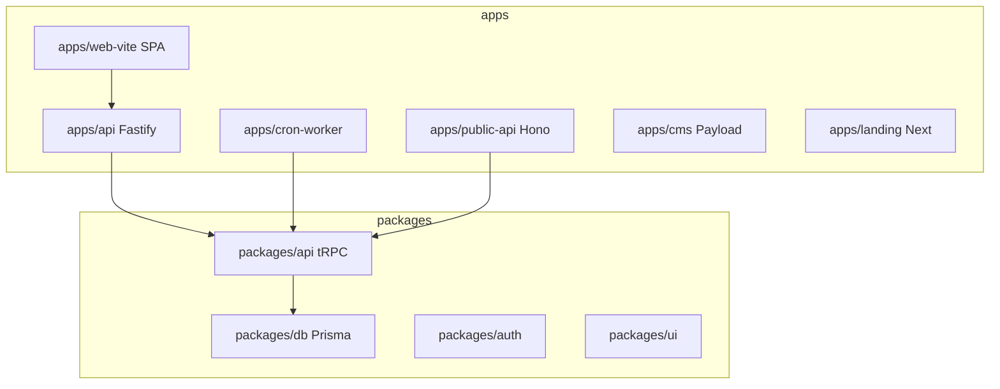

# Monorepo topology

> **Do not cite router counts from this page alone.** Verify `packages/api/src/root.ts`.

## Purpose

contractor-ops is a pnpm 10 + Turborepo monorepo: six deployable **apps** and ~18 shared **packages**. Domain logic lives in packages; apps are HTTP/SPA entrypoints.

## Flow



## Entry points

| Layer | Path | Role |
|-------|------|------|
| Workspace | `pnpm-workspace.yaml`, `turbo.json` | 7-day `minimumReleaseAge` on deps |
| Staff HTTP | `apps/api/src/server.ts` | Fastify factory — no listen in tests |
| Staff SPA | `apps/web-vite/src/main.tsx` | Vite + React + tRPC client |
| tRPC core | `packages/api/src/root.ts` | `appRouter` namespaces |
| Portal tRPC | `packages/api/src/portal-root.ts` | `portalAppRouter` |
| Planning | `.planning/` | Not shipped — INDEX, codebase maps, brain wiki |

## Invariants

- `packages/*` changes → typecheck downstream `apps/*`
- New env → `.env.example` + package `env.ts`
- Tenant from session — never client `organizationId` alone

## Related

- [[apps]]
- [[packages]]
- [[api-routers-catalog]]
- [[patterns/trpc-procedure-stack]]

## Verify live

```bash
semble search "buildServer"
pnpm typecheck --filter=@contractor-ops/api
```

## Agent mistakes

- Assuming `apps/web` exists — canonical SPA is `apps/web-vite`
- Editing routers without registering in `root.ts`
- Bypassing 7-day dep age with `@latest`
