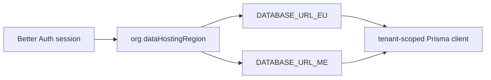

# Prisma schema areas

## Purpose

PostgreSQL 17 schema split across files in `packages/db/prisma/schema/`. Multi-region routing via `DATABASE_URL_EU` / `_ME`.

## Entry points

| Area | Typical files | Domain |
|------|---------------|--------|
| Core org/users | `schema.prisma` + org models | [[domains/settings-and-org-admin]] |
| Financial | `financial.prisma` | [[domains/invoice-to-payment]] |
| Compliance | compliance-related models | [[domains/compliance-dashboard]] |
| Time tracking | `time-tracking.prisma` | [[domains/time-and-reconciliation]] |
| E-invoice | `einvoice.prisma` | [[integrations/einvoice-profiles]] |
| Billing | `billing.prisma` — `Subscription` (Stripe-synced, `organizationId`/`stripeSubscriptionId @unique`, `tier`/`status` drive `requireTier`), `OcrCreditLedger`, `StripeEvent` (webhook dedup, `stripeEventId @unique`). `Subscription.lastEventCreated DateTime?` = source-event `created` watermark for the webhook out-of-order guard (a redelivered STALE event whose `created` predates it is a no-op — added additive migration `20260705120000_subscription_last_event_created`, nullable/zero-backfill). See [[integrations/stripe-billing]] | [[domains/billing-and-feature-gates]] |
| Cron job state | `cron.prisma` — `CronJobRunState` (global, NOT tenant-scoped: one row per scheduled job keyed `jobName @unique`, `lastSuccessAt`/`lastRunAt`). Persists last-success across cron-worker restarts (the in-memory map was wiped on restart) so job-health can alert on staleness | [[structure/cron-jobs]] |
| Equipment | equipment models | [[domains/equipment-logistics]] |
| Tax / WHT / treaty | `tax.prisma` — `WithholdingTaxRate` (shared rate table; `treatyArticle` column drives US treaty auto-populate), `WhtCertificate`, `TaxFormSubmission` (append-only, supersede-chained W-9/W-8BEN/W-8BEN-E record FK'd to `Contractor`). **Phase 87 US expansion (all tenant-owning, NOT in `globalModels`):** `Form1042S` (immutable + supersede-chain chapter-3 record — box-1 income code, box-2 gross minor, box-3a/3b + 4a/4b ch3/ch4 exemption codes + rates, box-7 withheld, recipient 13j/13k/13n status + LOB, `treatyArticle`, FTIN last-4 `snapshotJson`, `corrected`, `supersededById`, soft-delete `deletedAt`; supersede via `updateMany`, **NOT** in `APPEND_ONLY_MODELS`, mirrors `Form1099Nec`); `Form1099KTrackerState` (per-`(contractorId, taxYear)` informational band SAFE/APPROACHING/OVER + `lastScannedAt`/`lastCrossedAt`/`lastReminderAt`, mirrors `EconomicDependencyAlertState`); `Tax1099KThreshold` (tax-year-keyed config `@unique(taxYear)`, seeded $20,000 + 200 TY2026 OBBBA via `seed/tax-1099k-threshold.ts`). Also `ClassificationDocumentKind.US_DETERMINATION_LETTER` (`classification.prisma`) + nullable-additive `ContractorAssignment.workState` (`contractor.prisma` — the AB5 work-state trigger). Cross-org leak regression `cross-org-leak-1042s.test.ts`; live per-region apply DEFERRED (LOCAL-ONLY) | [[domains/tax-and-wht]], [[domains/us-tax-forms]], [[domains/us-classification]] |
| US year-end filing | `tax.prisma` — `Form1099Nec` (immutable supersede-chained 1099-NEC record; `payerOrgId` aggregation axis, box1/box4 minor units, `cfsfStateCode`, last-4-only `snapshotJson`, `deletedAt`; registered in `MODEL_RETENTION_TYPE` `'1099-NEC'` 4yr + `softDeleteModels`), `IrisSubmission` + `IrisAck` (append-only; schema `VersionNum`/`VersionDt`, six-state `IrisAckStatus`, Error Information Group JSON), `Tax1099Threshold` (tax-year-keyed — $600 TY2025 / $2,000 TY2026), `StateFilingConfig` (per-state CF/SF participation + direct-filing) | [[domains/us-tax-year-end-filing]] |
| Worker model | `worker.prisma` — `Worker` identity root (`organizationId`, `workerType WorkerType @default(CONTRACTOR)`, shared `displayName`/`email`/`status`, soft-delete; tenant-owning, NOT in `globalModels`) + `WorkerType` enum; `Contractor.workerId String @unique` 1:1 sidecar FK (`Contractor.id` unchanged). Two-step additive ordering: nullable column + table → backfill → NOT NULL + FK | [[domains/worker-foundation]] |
| Employee profile | `employee.prisma` — `EmployeeProfile` tenant-owning HR payload attached 1:1 to `Worker` via `workerId String @unique` (an employee is a `Worker(workerType='EMPLOYEE')` — there is NO `Employee` table). Hybrid storage: `countryFields Json?` (non-PII per-market fields) + four dedicated AES-256-GCM national-ID column pairs (`pesel/ssn/iqama/emiratesId` `*Encrypted`+`*Last4`, never in JSON) + promoted typed columns `saudizationCategory NitaqatBand?` / `etat Decimal @db.Decimal(3,2)` / `employmentStatus EmploymentStatus?`. `enum EmploymentStatus { ACTIVE ON_LEAVE SUSPENDED TERMINATED }`. HR-dashboard aggregation columns (added for the staff HR dashboard, all nullable + org-composite-indexed): `department String?` / `employmentType EmploymentType?` (the **contract-type** axis — `enum EmploymentType { FULL_TIME PART_TIME FIXED_TERM TEMPORARY APPRENTICE SEASONAL }` — distinct from the `employmentStatus` lifecycle axis) / `contractEndDate DateTime? @db.Date` (scheduled calendar end, distinct from the administrative `terminatedAt` instant) / `probationEndsAt DateTime? @db.Date` (watchlist anchor). `@@unique([organizationId, workerId])` + org indexes; NOT in `globalModels`. Nullable self-relation `managerWorkerId` (FK → `Worker.id`, relation `EmployeeManager`, `@@index([organizationId, managerWorkerId])`) = the reporting-line edge direct reports resolve off (a manager is a worker some other profile's `managerWorkerId` targets); same-org integrity is enforced in the reports resolver, NOT the FK. Authored additive migrations `__employee_profile_additive` + `__portal_employee_subject` + `__hr_dashboard_columns` (+ `down.sql`) — live per-region apply DEFERRED (LOCAL-ONLY) | [[domains/employee-registry]] |
| Personnel file | `personnel.prisma` — `PersonnelFile` 1:1 tenant-owning sidecar on `Worker` via `workerId String @unique` (`@@unique([organizationId, workerId])`; `countryCode` jurisdiction snapshot + `hireDate DateTime? @db.Date` hire anchor + `terminatedAt DateTime?` termination anchor, null = active = retain indefinitely). `PersonnelFileDocument` references the existing `Document` stack 1:1 (`documentId @unique`, never forked) + optional `section PersonnelFileSection?` — the 4-section view is an **enum-on-link**, not a row-per-section table. `enum PersonnelFileSection { SECTION_A..D }`, `enum PersonnelDocClassificationMethod { DETERMINISTIC AI MANUAL PENDING }`. HR-dashboard doc-expiry columns (nullable): `expiresAt DateTime? @db.Date` (TZ-correct expiry anchor read through the compliance-policy date math; null = non-expiring) + `docCategory EmployeeDocCategory?` (`enum EmployeeDocCategory { VISA WORK_PERMIT CONTRACT_RENEWAL MEDICAL_CERT TRAINING_CERT OTHER }`), `@@index([organizationId, expiresAt])`. Both tenant-owning, NOT in `globalModels`. Additive reversible migrations `__personnel_file_additive` + `__hr_dashboard_columns` (+ `down.sql`) — live per-region apply DEFERRED (LOCAL-ONLY) | [[domains/personnel-file]] |
| US payment rail | `contractor.prisma` — `Contractor.backupWithholdingFlagged Boolean?` (FK-free queryable flag the payment-run seeding reads to deduct IRC §3406 24%); `ContractorBillingProfile` US ACH `usRoutingNumber`/`usAccountNumber` encrypted+masked pairs (AES-256-GCM, mirrors the UK BACS pair) + Plaid advisory `plaidVerificationStatus String?` (VERIFIED/PENDING/FAILED — not a Prisma enum) / `plaidVerifiedAt` / `plaidAccountId`. `payment.prisma` — `PaymentExportFormat` enum gains `ACH_NACHA` + `FEDWIRE`; `PaymentRunItem` withholding fields (`grossAmountMinor`/`whtAmountMinor`/`whtRate`/`whtTreatyApplied`) are the deduction substrate and the single source of truth the 1099/1042-S aggregate. Additive-only migration `20260701000000_phase88_us_payment_rail_schema` (nullable columns + enum ADD VALUE) | [[domains/us-payment-rail]] |
| Portal auth | `portal.prisma` — `PortalSession` authenticates a **discriminated subject**: `subjectType PortalSubjectType @default(CONTRACTOR)` + nullable `contractorId` + nullable `workerId` (FK → `Worker.id`), mutually exclusive. `enum PortalSubjectType { CONTRACTOR EMPLOYEE }`. A raw-SQL one-of CHECK (`PortalSession_subject_one_of`, in `__portal_employee_subject/migration.sql` — Prisma cannot express a multi-column CHECK) enforces exactly one subject matching `subjectType`; existing rows backfill to `CONTRACTOR` so the contractor login is untouched. `PortalMagicToken` unchanged. Global (NOT tenant-scoped) models. Authored additive migration `__portal_employee_subject` (+ `down.sql`) — apply DEFERRED (LOCAL-ONLY) | [[domains/employee-registry]] |
| Leave & employee time | `leave.prisma` — `LeaveType`, `BlackoutPeriod`, `LeaveRequest` (FK `approvalFlowId` → the generic chain), `LeaveLedgerEntry` (**append-only** — registered in `APPEND_ONLY_MODELS` in `packages/db/src/tenant.ts`; corrections are reversing `ADJUSTMENT` rows), `LeaveBalance` cache + `LeaveKind`/`LeaveRequestStatus`/`LeaveLedgerType`. `employee-time.prisma` — `EmployeeTimeRecord` (day-grain `@@unique([organizationId, workerId, workDate])`, DISTINCT from the contractor `TimeEntry`) + `EmployeeTimeSource`/`AbsenceKind`. `ewidencja.prisma` — `EwidencjaSnapshot` (INSERT-only versioned, `previousSnapshotId` chain, `EwidencjaStatus`; DB-immutable via `BEFORE UPDATE` trigger `app.reject_ewidencja_update`, migration `20260701000000_ewidencja_append_only`). `reference.prisma` — `PublicHoliday` (seeded, drives calendar holiday cells). All tenant-owning, NOT in `globalModels` | [[domains/leave-and-time]] |
| Tax / WHT / treaty | `tax.prisma` — `WithholdingTaxRate` (shared rate table; `treatyArticle` column drives US treaty auto-populate), `WhtCertificate`, `TaxFormSubmission` (append-only, supersede-chained W-9/W-8BEN/W-8BEN-E record FK'd to `Contractor`). **Phase 87 US expansion (all tenant-owning, NOT in `globalModels`):** `Form1042S` (immutable + supersede-chain chapter-3 record — box-1 income code, box-2 gross minor, box-3a/3b + 4a/4b ch3/ch4 exemption codes + rates, box-7 withheld, recipient 13j/13k/13n status + LOB, `treatyArticle`, FTIN last-4 `snapshotJson`, `corrected`, `supersededById`, soft-delete `deletedAt`; supersede via `updateMany`, **NOT** in `APPEND_ONLY_MODELS`, mirrors `Form1099Nec`); `Form1099KTrackerState` (per-`(contractorId, taxYear)` informational band SAFE/APPROACHING/OVER + `lastScannedAt`/`lastCrossedAt`/`lastReminderAt`, mirrors `EconomicDependencyAlertState`); `Tax1099KThreshold` (tax-year-keyed config `@unique(taxYear)`, seeded $20,000 + 200 TY2026 OBBBA via `seed/tax-1099k-threshold.ts`). Also `ClassificationDocumentKind.US_DETERMINATION_LETTER` (`classification.prisma`) + nullable-additive `ContractorAssignment.workState` (`contractor.prisma` — the AB5 work-state trigger). Cross-org leak regression `cross-org-leak-1042s.test.ts`; live per-region apply DEFERRED (LOCAL-ONLY). **CREATE TABLE migration authored** (`20260705000000_us_tax_form_tables_plus_additive_integrity`) — the nine tables (`TaxFormSubmission`, `Form1099Nec`, `IrisSubmission`, `IrisAck`, `Tax1099Threshold`, `StateFilingConfig`, `Form1042S`, `Form1099KTrackerState`, `Tax1099KThreshold`) previously lived in schema only (a fresh regional DB errored `relation does not exist`; local dev hid it via db-push). `Form1042S` gains a partial UNIQUE `Form1042S_active_key` on `(organizationId, payerOrgId, recipientId, taxYear) WHERE status='ACTIVE'` (the DB backstop for batch-generation idempotency; DRAFT/SUPERSEDED excluded) | [[domains/tax-and-wht]], [[domains/us-tax-forms]], [[domains/us-classification]] |
| Tax / WHT / treaty | `tax.prisma` — `WithholdingTaxRate` (shared rate table; `treatyArticle` column drives US treaty auto-populate), `WhtCertificate`, `TaxFormSubmission` (append-only, supersede-chained W-9/W-8BEN/W-8BEN-E record FK'd to `Contractor`). **Phase 87 US expansion (all tenant-owning, NOT in `globalModels`):** `Form1042S` (immutable + supersede-chain chapter-3 record — box-1 income code, box-2 gross minor, box-3a/3b + 4a/4b ch3/ch4 exemption codes + rates, box-7 withheld, recipient 13j/13k/13n status + LOB, `treatyArticle`, FTIN last-4 `snapshotJson`, `corrected`, `supersededById`, soft-delete `deletedAt`; supersede via `updateMany`, **NOT** in `APPEND_ONLY_MODELS`, mirrors `Form1099Nec`); `Form1099KTrackerState` (per-`(contractorId, taxYear)` informational band SAFE/APPROACHING/OVER + `lastScannedAt`/`lastCrossedAt`/`lastReminderAt`, mirrors `EconomicDependencyAlertState`); `Tax1099KThreshold` (tax-year-keyed config `@unique(taxYear)`, seeded $20,000 + 200 TY2026 OBBBA via `seed/tax-1099k-threshold.ts`). Also `ClassificationDocumentKind.US_DETERMINATION_LETTER` (`classification.prisma`) + nullable-additive `ContractorAssignment.workState` (`contractor.prisma` — the AB5 work-state trigger). Cross-org leak regression `cross-org-leak-1042s.test.ts`; live per-region apply DEFERRED (LOCAL-ONLY). **CREATE TABLE migration authored** (`20260705000000_us_tax_form_tables_plus_additive_integrity`) — the nine tables (`TaxFormSubmission`, `Form1099Nec`, `IrisSubmission`, `IrisAck`, `Tax1099Threshold`, `StateFilingConfig`, `Form1042S`, `Form1099KTrackerState`, `Tax1099KThreshold`) previously lived in schema only (a fresh regional DB errored `relation does not exist`; local dev hid it via db-push). `Form1042S` gains a partial UNIQUE `Form1042S_active_key` on `(organizationId, payerOrgId, recipientId, taxYear) WHERE status='ACTIVE'` (the DB backstop for batch-generation idempotency; DRAFT/SUPERSEDED excluded); `Form1099Nec` gains the mirror `Form1099Nec_active_key` (same key + `WHERE status='ACTIVE'::"Form1099Status"`, additive migration `20260705130000_form1099nec_active_key`, so a redundant ACTIVE 1099-NEC per recipient/year is rejected P2002-as-skip) | [[domains/tax-and-wht]], [[domains/us-tax-forms]], [[domains/us-classification]] |
| Worker model | `worker.prisma` — `Worker` identity root (`organizationId`, `workerType WorkerType @default(CONTRACTOR)`, shared `displayName`/`email`/`status`, soft-delete; tenant-owning, NOT in `globalModels`) + `WorkerType` enum; `Contractor.workerId String @unique` 1:1 sidecar FK (`Contractor.id` unchanged). Two-step additive ordering: nullable column + table → backfill → NOT NULL + FK | [[domains/worker-foundation]] |
| Employee profile | `employee.prisma` — `EmployeeProfile` tenant-owning HR payload attached 1:1 to `Worker` via `workerId String @unique` (an employee is a `Worker(workerType='EMPLOYEE')` — there is NO `Employee` table). Hybrid storage: `countryFields Json?` (non-PII per-market fields) + four dedicated AES-256-GCM national-ID column pairs (`pesel/ssn/iqama/emiratesId` `*Encrypted`+`*Last4`, never in JSON) + promoted typed columns `saudizationCategory NitaqatBand?` / `etat Decimal @db.Decimal(3,2)` / `employmentStatus EmploymentStatus?`. `enum EmploymentStatus { ACTIVE ON_LEAVE SUSPENDED TERMINATED }`. `@@unique([organizationId, workerId])` + org indexes; NOT in `globalModels`. Authored additive migration `__employee_profile_additive` (+ `down.sql`) — live per-region apply DEFERRED (LOCAL-ONLY). That migration also `CREATE TYPE`s the Gulf `NitaqatBand` enum it consumes for `saudizationCategory`: the type is created by no other migration (`SaudizationConfig.band` in `gulf.prisma` is db-push-only), so before this it failed a fresh `migrate diff --from-migrations` replay with `type "NitaqatBand" does not exist` | [[domains/employee-registry]] |
| Personnel file | `personnel.prisma` — `PersonnelFile` 1:1 tenant-owning sidecar on `Worker` via `workerId String @unique` (`@@unique([organizationId, workerId])`; `countryCode` jurisdiction snapshot + `hireDate DateTime? @db.Date` hire anchor + `terminatedAt DateTime?` termination anchor, null = active = retain indefinitely). `PersonnelFileDocument` references the existing `Document` stack 1:1 (`documentId @unique`, never forked) + optional `section PersonnelFileSection?` — the 4-section view is an **enum-on-link**, not a row-per-section table. `enum PersonnelFileSection { SECTION_A..D }`, `enum PersonnelDocClassificationMethod { DETERMINISTIC AI MANUAL PENDING }`. Both tenant-owning, NOT in `globalModels`. Additive reversible migration `__personnel_file_additive` (+ `down.sql`) — live per-region apply DEFERRED (LOCAL-ONLY) | [[domains/personnel-file]] |
| US payment rail | `contractor.prisma` — `Contractor.backupWithholdingFlagged Boolean?` (FK-free queryable flag the payment-run seeding reads to deduct IRC §3406 24%); `ContractorBillingProfile` US ACH `usRoutingNumber`/`usAccountNumber` encrypted+masked pairs (AES-256-GCM, mirrors the UK BACS pair) + Plaid advisory `plaidVerificationStatus String?` (VERIFIED/PENDING/FAILED — not a Prisma enum) / `plaidVerifiedAt` / `plaidAccountId`. `payment.prisma` — `PaymentExportFormat` enum gains `ACH_NACHA` + `FEDWIRE`; `PaymentRunItem` withholding fields (`grossAmountMinor`/`whtAmountMinor`/`whtRate`/`whtTreatyApplied`) are the deduction substrate and the single source of truth the 1099/1042-S aggregate. Additive-only migration `20260701000000_phase88_us_payment_rail_schema` (nullable columns + enum ADD VALUE). **FX provenance + ACH ledger** (migration `20260705000000_...additive_integrity`): `PaymentRunItem.settlementRate Decimal? @db.Decimal(18,8)` + `settlementRateDate DateTime? @db.Date` (nullable — the rate actually applied to a converted payout; populated by a later settlement-path change); new `AchReturnLedgerEntry` table (org + `paymentRun` FKs, optional `paymentRunItem`, `entryType AchReturnEntryType {RETURN, NOTIFICATION_OF_CHANGE}`, `traceNumber`/`returnCode`/`individualId`/`amountMinor`/`addendaInfo`/`fileSha256`) with `@@unique([paymentRunId, traceNumber, returnCode])` (`ach_return_entry_run_trace_code_uniq`) — the entry-level idempotency backstop for return-file re-uploads/redeliveries | [[domains/us-payment-rail]] |
| E-sign | `esign.prisma` — `SigningEnvelope` / `SigningRecipient` / `SigningEvent` (provider e-sign lifecycle; `@@unique([provider, externalEnvelopeId])`). `EsignEnvelopeIntent` (tenant-owning, NOT in `globalModels`; migration `20260705140000_esign_envelope_intent`) is the **pre-provider idempotency ledger**: `@@unique([organizationId, documentId, signerSetHash])` (`esign_envelope_intent_dedup_key`) + `provider`/`integrationConnectionId`/`externalEnvelopeId?`. The orchestrator creates the provider envelope BEFORE its DB tx, so a rollback+retry can duplicate the provider process — DocuSign is covered by `X-DocuSign-Idempotency-Key`, but Autenti's `POST /document-processes` accepts no idempotency header or client reference (verified against the Autenti v2 public API), so the service writes an intent row on the deterministic business key first and short-circuits duplicates | [[integrations/docusign-esign]] |

## Flow



## Invariants

- Migrations: `packages/db/prisma/schema/migrations/`
- RLS: `packages/db/src/rls.ts` — `withRlsReads`, `withRlsTransactions`
- Tenant client: `createTenantClientFrom` via db tenant extension
- Sensitive mutations: pass `tx` to `writeAuditLog`
- DB-enforced integrity backstops (migration `20260616000000_security_hardening_constraints`): `Contractor` `@@unique([organizationId, taxId])` (taxId nullable → NULLs distinct, un-registered contractors unaffected); `PaymentExport` `@@unique([paymentRunId])` (one export per run); `Invoice` `@@index([organizationId, paymentStatus, paidAt])` for PAID-by-window spend reports
- **Partial-unique concurrency backstops** (migration `20260705000000_...additive_integrity`; enabled by generator `previewFeatures = ["partialIndexes"]`, PSL `@@unique(..., where: raw("..."))`): `Form1042S_active_key` (one ACTIVE row per `(org, payer, recipient, year)`) + its mirror `Form1099Nec_active_key` (same key/predicate, migration `20260705130000_form1099nec_active_key`); `PeppolTransmission_invoiceId_active_key` (one in-flight transmission per invoice — `WHERE status IN (PENDING, TRANSMITTED)`, terminal + null invoiceId excluded, so a failed attempt can re-transmit); `InvoiceInterestClaim @@unique([invoiceId])` (full unique — a claim is never voided, so one claim + one LPC-* secondary invoice per invoice). Each is the DB half of a P2002-as-skip/conflict guard whose service code lands in a later change set
- **AuditLog append-only** (migration `20260617000000_auditlog_append_only`): replaces the over-broad `auditlog_write FOR ALL` policy with INSERT-only (`auditlog_insert`) + a gated DELETE (`auditlog_delete`, permitted only when `app.audit_purge_allowed()` is set via `allowAuditPurge(tx)`) + a `BEFORE UPDATE` trigger (`app.reject_auditlog_update`) that rejects every update. See [[patterns/audit-log]]
- **Worker reads are `workerType`-scoped centrally** — `withWorkerTypeDefault` (`packages/db/src/worker-type.ts`) is chained outermost in the tenant client and injects `workerType='CONTRACTOR'` unless the caller sets it (explicit-where-wins). Its blind spot is raw `FROM "Contractor"` SQL — the 4 known sites are contractor-only-by-table and annotated `// contractor-only-raw-sql:`; `check:contractor-rawsql-workertype` (in `lint:ci`) fails any new unannotated one. See [[domains/worker-foundation]]

## Related

- [[patterns/multi-region-db]]
- [[patterns/tenant-and-audit]]
- [[integrations/neon-r2]]

## Verify live

```bash
ls packages/db/prisma/schema/
semble search "withRlsTransactions"
pnpm typecheck --filter=@contractor-ops/db
```

## Agent mistakes

- Trusting client `organizationId` without session middleware
- Raw SQL without tenant scope — `pnpm lint:raw-sql`

## Worker on/offboarding (Phase 93 — `__phase93_worker_lifecycle`, un-applied)

Additive, drift-safe, authored un-applied (per-region apply is a deferred human gate):

- `EntityType += WORKER, EMPLOYEE, MARKETPLACE_LISTING, INCIDENT` (and `AuditEntityType` mirror in `audit-writer.ts`).
- **Theme C (Phase 101, un-applied `__phase101_*`):** `Organization.isSandbox` + `OrganizationApiKey.environment` (new `ApiKeyEnvironment { LIVE SANDBOX }`) — the sandbox axis; `resolveByPrefix` fails closed on any mismatch. `IncidentReport` (global, `IncidentStatus`/`IncidentSeverity` enums) — public status-page incident history. `MarketplaceListing` (Phase-101 marketplace tracker) is a separate un-applied migration. See [[domains/developer-experience]].
- `WorkflowRun.workerId?` (+ `worker Worker?` relation + `@@index([organizationId, workerId])`) — the employee-run subject, mutually exclusive with `contractorId` (defence-in-depth CHECK `contractor XOR worker`).
- `WorkflowTemplate.jurisdiction? + seedKey? + @@unique([organizationId, jurisdiction, type, seedKey])` — the idempotent per-market boot-upsert key (employee-templates seeds).
- `DeprovisioningRun`: `contractorId`/`assignmentId` relaxed to nullable + `workerId?` (+ relation + index + CHECK) — an employee run keys off `workerId`; DROP NOT NULL is non-destructive.
- `EmployeeProfile.terminatedAt?` — the dated termination signal feeding the 14-day IdP cooldown (mirrors `ContractorAssignment.endedAt`).
- New tenant-owning `StatutoryCertificate` (`organizationId`, `workflowRunId`, `workerId`, `certType`, `jurisdiction`, `status StatutoryCertificateStatus DRAFT`, `snapshotJson`, `pdfArchiveKey?`) — mirrors the `Form1099Nec` snapshot+CAS shape; absent from `globalModels`. Detail: [[domains/worker-onboarding-offboarding]].

## HRIS two-way sync (Phase 95 — `__20260705120000_hris_two_way_sync`, un-applied)

Additive, drift-safe, authored un-applied:

- `IntegrationProvider += PERSONIO, BAMBOOHR`.
- **One HRIS per org** = a raw-SQL **PARTIAL unique index** `integration_connection_one_hris_per_org ON "IntegrationConnection"("organizationId") WHERE "provider"::text IN ('PERSONIO','BAMBOOHR')`. Prisma `@@unique` cannot filter; the `::text` cast sidesteps Postgres's "new enum value in the same transaction" restriction. P2002 on connect → typed `CONFLICT` (`isOneHrisPerOrgViolation`). No new table — the field mapping + snapshot-diff sync-state live in `IntegrationConnection.configJson`. Detail: [[domains/hris-sync]].
