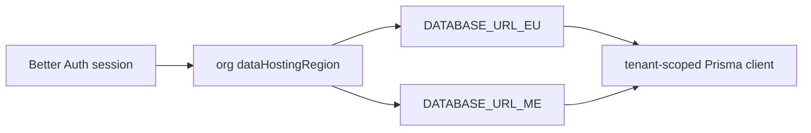

# Prisma schema areas

## Purpose

PostgreSQL 17 schema split across files in `packages/db/prisma/schema/`. Multi-region routing via `DATABASE_URL_EU` / `_ME`.

## Entry points

| Area | Typical files | Domain |
|------|---------------|--------|
| Core org/users | `schema.prisma` + org models | [[domains/settings-and-org-admin]] |
| Financial | `financial.prisma` | [[domains/invoice-to-payment]] |
| Compliance | compliance-related models | [[domains/compliance-dashboard]] |
| Time tracking | `time-tracking.prisma` | [[domains/time-and-reconciliation]] |
| E-invoice | `einvoice.prisma` | [[integrations/einvoice-profiles]] |
| Equipment | equipment models | [[domains/equipment-logistics]] |
| Tax / WHT / treaty | `tax.prisma` — `WithholdingTaxRate` (shared rate table; `treatyArticle` column drives US treaty auto-populate), `WhtCertificate`, `TaxFormSubmission` (append-only, supersede-chained W-9/W-8BEN/W-8BEN-E record FK'd to `Contractor`) | [[domains/tax-and-wht]], [[domains/us-tax-forms]] |

## Flow



## Invariants

- Migrations: `packages/db/prisma/schema/migrations/`
- RLS: `packages/db/src/rls.ts` — `withRlsReads`, `withRlsTransactions`
- Tenant client: `createTenantClientFrom` via db tenant extension
- Sensitive mutations: pass `tx` to `writeAuditLog`

## Related

- [[patterns/multi-region-db]]
- [[patterns/tenant-and-audit]]
- [[integrations/neon-r2]]

## Verify live

```bash
ls packages/db/prisma/schema/
semble search "withRlsTransactions"
pnpm typecheck --filter=@contractor-ops/db
```

## Agent mistakes

- Trusting client `organizationId` without session middleware
- Raw SQL without tenant scope — `pnpm lint:raw-sql`
