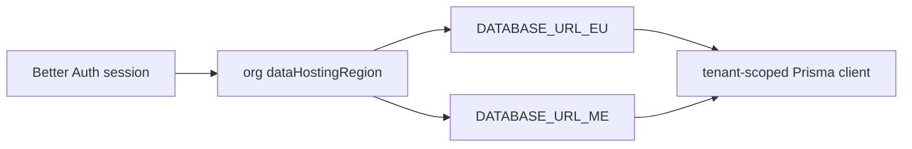

# Prisma schema areas

## Purpose

PostgreSQL 17 schema split across files in `packages/db/prisma/schema/`. Multi-region routing via `DATABASE_URL_EU` / `_ME`.

## Entry points

| Area | Typical files | Domain |
|------|---------------|--------|
| Core org/users | `schema.prisma` + org models | [[domains/settings-and-org-admin]] |
| Financial | `financial.prisma` | [[domains/invoice-to-payment]] |
| Compliance | compliance-related models | [[domains/compliance-dashboard]] |
| Time tracking | `time-tracking.prisma` | [[domains/time-and-reconciliation]] |
| E-invoice | `einvoice.prisma` | [[integrations/einvoice-profiles]] |
| Equipment | equipment models | [[domains/equipment-logistics]] |
| Tax / WHT / treaty | `tax.prisma` — `WithholdingTaxRate` (shared rate table; `treatyArticle` column drives US treaty auto-populate), `WhtCertificate`, `TaxFormSubmission` (append-only, supersede-chained W-9/W-8BEN/W-8BEN-E record FK'd to `Contractor`) | [[domains/tax-and-wht]], [[domains/us-tax-forms]] |
| Worker model | `worker.prisma` — `Worker` identity root (`organizationId`, `workerType WorkerType @default(CONTRACTOR)`, shared `displayName`/`email`/`status`, soft-delete; tenant-owning, NOT in `globalModels`) + `WorkerType` enum; `Contractor.workerId String @unique` 1:1 sidecar FK (`Contractor.id` unchanged). Two-step additive ordering: nullable column + table → backfill → NOT NULL + FK | [[domains/worker-foundation]] |
| Employee profile | `employee.prisma` — `EmployeeProfile` tenant-owning HR payload attached 1:1 to `Worker` via `workerId String @unique` (an employee is a `Worker(workerType='EMPLOYEE')` — there is NO `Employee` table). Hybrid storage: `countryFields Json?` (non-PII per-market fields) + four dedicated AES-256-GCM national-ID column pairs (`pesel/ssn/iqama/emiratesId` `*Encrypted`+`*Last4`, never in JSON) + promoted typed columns `saudizationCategory NitaqatBand?` / `etat Decimal @db.Decimal(3,2)` / `employmentStatus EmploymentStatus?`. `enum EmploymentStatus { ACTIVE ON_LEAVE SUSPENDED TERMINATED }`. `@@unique([organizationId, workerId])` + org indexes; NOT in `globalModels`. Authored additive migration `__employee_profile_additive` (+ `down.sql`) — live per-region apply DEFERRED (LOCAL-ONLY) | [[domains/employee-registry]] |
| Personnel file | `personnel.prisma` — `PersonnelFile` 1:1 tenant-owning sidecar on `Worker` via `workerId String @unique` (`@@unique([organizationId, workerId])`; `countryCode` jurisdiction snapshot + `hireDate DateTime? @db.Date` hire anchor + `terminatedAt DateTime?` termination anchor, null = active = retain indefinitely). `PersonnelFileDocument` references the existing `Document` stack 1:1 (`documentId @unique`, never forked) + optional `section PersonnelFileSection?` — the 4-section view is an **enum-on-link**, not a row-per-section table. `enum PersonnelFileSection { SECTION_A..D }`, `enum PersonnelDocClassificationMethod { DETERMINISTIC AI MANUAL PENDING }`. Both tenant-owning, NOT in `globalModels`. Additive reversible migration `__personnel_file_additive` (+ `down.sql`) — live per-region apply DEFERRED (LOCAL-ONLY) | [[domains/personnel-file]] |
| US payment rail | `contractor.prisma` — `Contractor.backupWithholdingFlagged Boolean?` (FK-free queryable flag the payment-run seeding reads to deduct IRC §3406 24%); `ContractorBillingProfile` US ACH `usRoutingNumber`/`usAccountNumber` encrypted+masked pairs (AES-256-GCM, mirrors the UK BACS pair) + Plaid advisory `plaidVerificationStatus String?` (VERIFIED/PENDING/FAILED — not a Prisma enum) / `plaidVerifiedAt` / `plaidAccountId`. `payment.prisma` — `PaymentExportFormat` enum gains `ACH_NACHA` + `FEDWIRE`; `PaymentRunItem` withholding fields (`grossAmountMinor`/`whtAmountMinor`/`whtRate`/`whtTreatyApplied`) are the deduction substrate and the single source of truth the 1099/1042-S aggregate. Additive-only migration `20260701000000_phase88_us_payment_rail_schema` (nullable columns + enum ADD VALUE) | [[domains/us-payment-rail]] |

## Flow



## Invariants

- Migrations: `packages/db/prisma/schema/migrations/`
- RLS: `packages/db/src/rls.ts` — `withRlsReads`, `withRlsTransactions`
- Tenant client: `createTenantClientFrom` via db tenant extension
- Sensitive mutations: pass `tx` to `writeAuditLog`
- DB-enforced integrity backstops (migration `20260616000000_security_hardening_constraints`): `Contractor` `@@unique([organizationId, taxId])` (taxId nullable → NULLs distinct, un-registered contractors unaffected); `PaymentExport` `@@unique([paymentRunId])` (one export per run); `Invoice` `@@index([organizationId, paymentStatus, paidAt])` for PAID-by-window spend reports
- **AuditLog append-only** (migration `20260617000000_auditlog_append_only`): replaces the over-broad `auditlog_write FOR ALL` policy with INSERT-only (`auditlog_insert`) + a gated DELETE (`auditlog_delete`, permitted only when `app.audit_purge_allowed()` is set via `allowAuditPurge(tx)`) + a `BEFORE UPDATE` trigger (`app.reject_auditlog_update`) that rejects every update. See [[patterns/audit-log]]
- **Worker reads are `workerType`-scoped centrally** — `withWorkerTypeDefault` (`packages/db/src/worker-type.ts`) is chained outermost in the tenant client and injects `workerType='CONTRACTOR'` unless the caller sets it (explicit-where-wins). Its blind spot is raw `FROM "Contractor"` SQL — the 4 known sites are contractor-only-by-table and annotated `// contractor-only-raw-sql:`; `check:contractor-rawsql-workertype` (in `lint:ci`) fails any new unannotated one. See [[domains/worker-foundation]]

## Related

- [[patterns/multi-region-db]]
- [[patterns/tenant-and-audit]]
- [[integrations/neon-r2]]

## Verify live

```bash
ls packages/db/prisma/schema/
semble search "withRlsTransactions"
pnpm typecheck --filter=@contractor-ops/db
```

## Agent mistakes

- Trusting client `organizationId` without session middleware
- Raw SQL without tenant scope — `pnpm lint:raw-sql`
